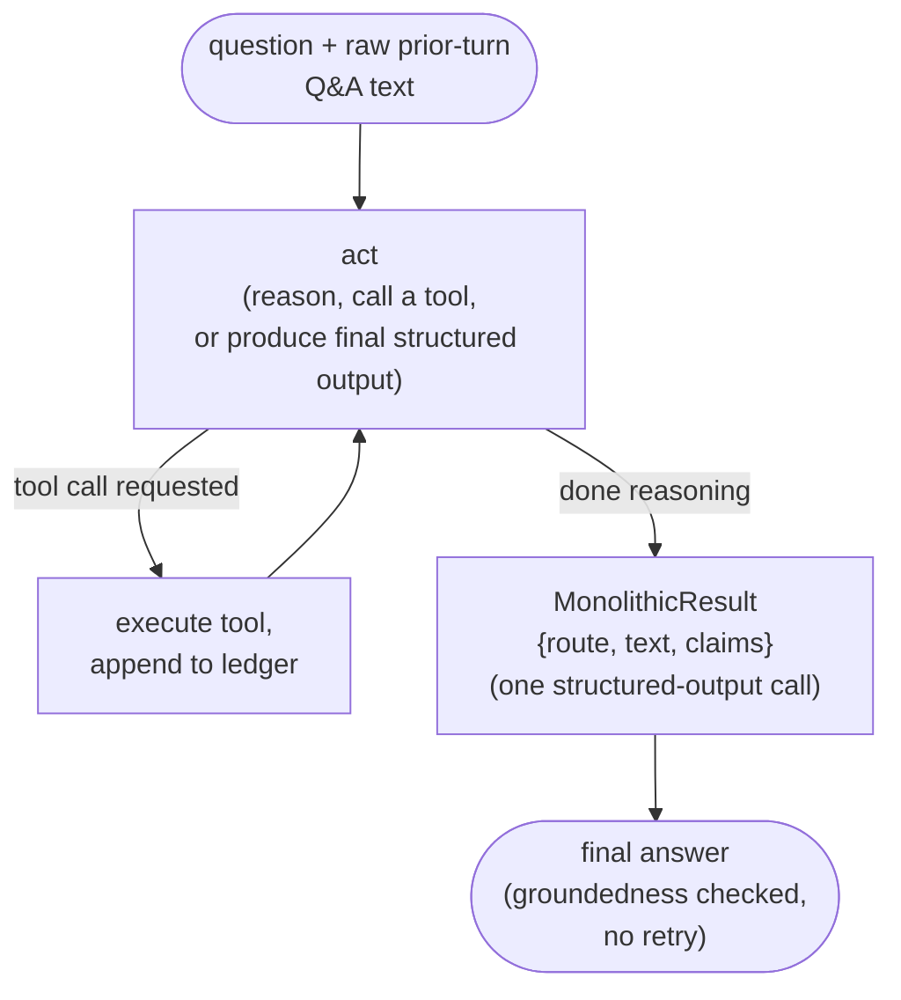
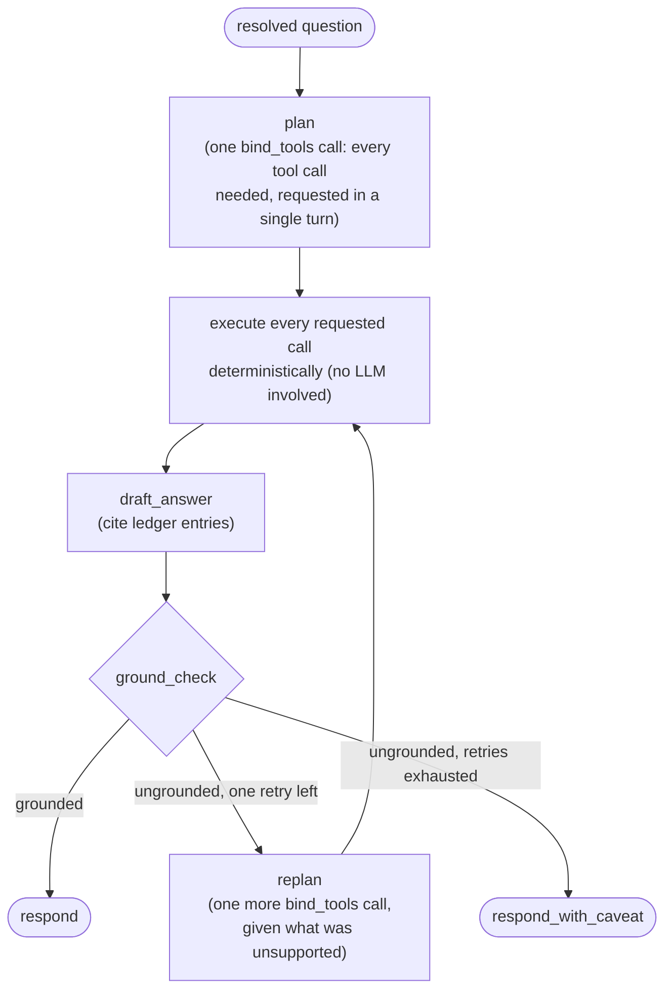
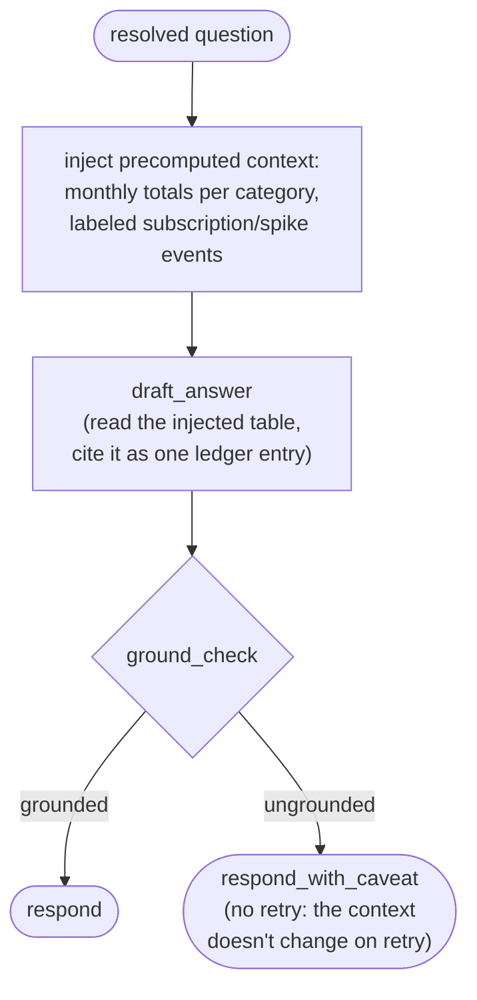

# Alternative Agent Architectures — Implementation Plan

Companion to [eval-harness-plan.md](eval-harness-plan.md) (which designed the `AgentAdapter` seam specifically so this would be possible without touching the harness) and [../report/evaluation-report.md](../report/evaluation-report.md) (whose findings motivate two of the three architectures below). This plan covers three new architectures to compare against the existing baseline (`langgraph`, implemented in `agent/langgraph_adapter.py`) on the identical 15-case test set and six scorers — no eval harness code changes required, which is itself the first thing this plan validates about the `AgentAdapter` design.

We are **not** building the no-tools single-prompt floor baseline from the earlier candidate list: with no way to access data at all, it cannot be grounded by construction, which makes it a poor comparison point rather than an informative one.

## 1. Why These Three, and What Each One Isolates

The baseline architecture bundles four design decisions together: (a) an explicit `contextualize` stage that resolves follow-ups into a self-contained question, (b) an explicit `route` stage that classifies answer/clarify/refuse before any tool call, (c) an *interleaved* ReAct loop (reason, call one tool, observe, repeat), and (d) a retry-on-ungrounded-draft loop. The evaluation report identified two concrete weaknesses in this design — a temporal-reasoning miss on trend questions (Section 4.3) and a 22.2% tool-call efficiency rate driven by iterative, defensive tool use (Section 4.4) — but a single architecture with a single result can't tell us whether those weaknesses come from the *model*, from *one specific stage*, or from the *interleaving* itself. Each new architecture removes or replaces exactly one of these decisions, so a difference in results is attributable to something specific:

| Architecture | Keeps (a) contextualize | Keeps (b) route | Tool-calling style | Keeps (d) retry |
|---|---|---|---|---|
| `langgraph` (baseline) | ✅ separate LLM call | ✅ separate LLM call | interleaved ReAct | ✅ |
| **Monolithic ReAct** (§2) | ❌ raw history instead | ❌ merged into final call | interleaved ReAct | ❌ |
| **Plan-and-Execute** (§3) | ✅ unchanged | ✅ unchanged | upfront batch plan, no interleaving | ✅ unchanged |
| **Context-Stuffing** (§4) | ✅ unchanged | ✅ unchanged | none — precomputed context, no tools | ✅ unchanged |

Plan-and-Execute and Context-Stuffing each change exactly one axis relative to the baseline, which is what makes a difference in their efficiency or correctness numbers interpretable as caused by that axis. Monolithic ReAct changes three axes at once (contextualize, route, and retry) deliberately — it's the "how much does all this staging actually buy us" question, not a controlled single-variable comparison.

## 2. Architecture: Monolithic Single-Stage ReAct

### 2.1 Design

One system prompt, one LLM (bound to the same six tools), one loop, no separate contextualize/route/retry stages:



- **No `contextualize` call.** Instead of resolving the question into a canonical form via a dedicated LLM call, the raw text of the last two turns (question + final answer, not the structured `TurnMemory`) is appended to the prompt as plain conversational history. The model must resolve "what about groceries?" itself, from raw context, the way a simpler chatbot would.
- **No separate `route` call.** The single final structured-output schema (`MonolithicResult`) asks the model to decide `route` (`answer`/`clarify`/`refuse`) *and*, if `route == "answer"`, produce `text` and `claims` in the same call — merging what the baseline splits into `route` + `draft_answer`.
- **No retry loop.** `groundedness.verify()` (reused as-is, Section 5) is still run against the claims, and the self-reported `groundedness_ok` still reflects its result, but an ungrounded draft is not retried — it's returned with a caveat appended, same wording as the baseline's exhausted-retry path. This tests whether the retry mechanism is worth its extra call(s), or whether most answers are grounded or not on the first attempt regardless.

### 2.2 Hypothesis

This architecture should be **cheaper** (fewer LLM calls per turn: no `contextualize`, no `route`, no retry) but is expected to be **weaker on multi-turn reference resolution** (Section 4 of the report showed the baseline's structured, resolved-question approach working correctly on all completed multi-turn cases; raw history has no equivalent mechanism forcing an explicit, checkable resolution) and possibly weaker on ambiguous-question detection, since routing is no longer a dedicated classification step with its own rubric-focused prompt.

## 3. Architecture: Plan-and-Execute

### 3.1 Design

Keeps `contextualize` and `route` exactly as the baseline does (reusing `agent/contextualize.py`, `agent/route.py`, and their prompts unchanged); replaces only the interleaved `act`/`tool_node` loop with a single upfront planning call followed by batch execution:



- **`plan`**: **not** a custom structured-output schema (an earlier version tried `Plan{tool_calls: list[PlannedToolCall{tool_name: str, args: dict}]}` this way; live testing showed `gemini-3.5-flash-lite` reliably returned an empty plan for it, even with an explicit example in the prompt — inspecting the schema showed why: `args: dict[str, Any]` renders as an `additionalProperties: true` open-ended object, a much harder target for constrained JSON decoding to populate than a schema the model was actually trained on). Instead, `plan` uses the same `llm.bind_tools(...)` native function-calling every ReAct-based architecture already uses for individual calls — the only difference is this is a *single* invocation with no loop back to observe a result before deciding on the next call, and native function-calling can (and does, in practice) return several tool calls from that one turn.
- **`execute`**: no LLM call. Every tool call in the plan response is dispatched against the same tool registry (`tools/registry.py::build_tools`) the baseline uses, appending to the ledger exactly as the baseline's `tool_node` does. An unrecognized tool name or invalid arguments is skipped, not fatal.
- **`draft_answer`** and **`ground_check`** are unchanged from the baseline (same prompts, same `verify()` call, same retry-limit config).
- **`replan`** (the retry path): another single `bind_tools` call — "here's what you planned, here's what came back, here's which claim was unsupported; call whatever additional tools you need" — keeping the retry mechanism structurally comparable to the baseline's (one bounded retry, same `groundedness_retry_limit` config) while staying consistent with this architecture's "decide everything in one turn" philosophy.

### 3.2 Hypothesis

This architecture should show a **material efficiency improvement** over the baseline specifically on the categories where the report found iterative overage — comparison and trend questions — since a single well-formed plan (e.g., one `aggregate_spending_tool` call with `group_by="category"` instead of two or three separate calls) is exactly what "optimal" already assumes is achievable. It carries a different risk: a bad upfront plan (e.g., planning `aggregate_spending_tool` for the wrong date range) has no chance to self-correct mid-execution the way an interleaved loop can adjust after seeing an intermediate result — so the trend-detection temporal-reasoning failure (Section 4.3 of the report) might reproduce identically, or could go either way depending on whether the error was about *iteration* or about *reasoning*.

Live spot-checks partially confirmed this: the comparison case used 2 calls in one non-interleaved turn versus the baseline's 3 across sequential turns (a real, if not fully optimal, efficiency gain — `compare_periods_tool` was called once per category instead of `aggregate_spending_tool` being used once with `group_by="category"`), but the same defensive `list_categories_tool` habit the report identified in the baseline reappeared here too — it's evidently a general tendency of this model/prompt style, not something specific to interleaving.

## 4. Architecture: Context-Stuffing (No Tools)

### 4.1 Design

Keeps `contextualize` and `route` unchanged; replaces tool-calling entirely with a precomputed data summary injected directly into the prompt:



- **No tools, no ledger-building calls.** A single precomputed table — monthly totals per category across the full date range, plus the two labeled anomaly events — is generated once (the same computation `data/generate.py` already does for `ground_truth.json`) and injected into the `draft_answer` prompt as context, every turn, regardless of the question.
- **One synthetic ledger entry.** To let the *same* `groundedness.verify()` function (Section 5) check this architecture's claims without special-casing it, the injected table is wrapped as a single `LedgerEntry` (`tool_name="context_table"`, `args={}`, `result=<the table>`) — from the scorer's perspective, this looks like the result of one (fictional) tool call. This is what makes it comparable at all under the existing harness rather than requiring a parallel scoring path.
- **No retry on ungrounded drafts.** The context doesn't change between attempts, so re-drafting from the same input is unlikely to fix an ungrounded claim — an ungrounded draft goes straight to the caveated response.

### 4.2 Hypothesis

Expected to do **well on simple lookups, comparisons, and trend/anomaly questions** (exactly what the precomputed table covers) and to **fail or refuse-by-necessity on multi-condition questions** (`multi_cond_001`'s amount threshold, `multi_cond_002`'s merchant filter) since those require row-level filtering the aggregated table doesn't contain. This is a real, expected limitation, not a bug to fix — the interesting result is *how* it fails (does it fabricate a plausible number from the aggregate table, or correctly decline?).

## 5. Shared Infrastructure

The following are reused unchanged by all three new architectures — no forking, no copies:

| Component | Reused as |
|---|---|
| `agent/answer.py` (`StructuredAnswer`, `Claim`) | The universal final-answer schema |
| `agent/groundedness.py::verify()` | The one groundedness check every architecture's self-reported `groundedness_ok` is computed from |
| `agent/contextualize.py`, `agent/route.py`, and their prompts | Reused verbatim by Plan-and-Execute and Context-Stuffing; **not** used by Monolithic ReAct (Section 2) |
| `tools/registry.py::build_tools()` | The tool dispatch table Monolithic ReAct's loop and Plan-and-Execute's `execute` step both call into |
| `tracing/trace.py::RunTrace` | The only contract each new adapter must produce — none of them use `AgentState`/`build_trace`/`TurnMemory`, which are LangGraph-specific; each new adapter constructs a `RunTrace` directly from its own local state |

Each new architecture gets its own `<Name>Config(BaseSettings)`, mirroring `LangGraphAgentConfig` (its own `env_prefix`, its own model field(s)), so model choice per architecture is independently configurable and none of them share a global "the model" setting — consistent with the separation `config.py` already enforces (Section 2 of the eval harness plan).

### 5.1 File Layout

New sibling modules under `src/finance_qna/agent/`, alongside the existing `langgraph_adapter.py` (not a new subpackage — four adapters doesn't yet justify the extra nesting; revisit if a fifth is added):

```
src/finance_qna/agent/
├── adapter.py                    # build_adapter: dispatch grows to 4 branches
├── langgraph_adapter.py          # existing baseline, unchanged
├── monolithic_adapter.py         # Architecture §2: MonolithicReactAdapter, MonolithicReactConfig, MonolithicResult
├── plan_execute_adapter.py       # Architecture §3: PlanExecuteAdapter, PlanExecuteConfig, Plan, PlannedToolCall
└── context_stuffing_adapter.py   # Architecture §4: ContextStuffingAdapter, ContextStuffingConfig
```

### 5.2 `build_adapter` Dispatch

```python
def build_adapter(settings: Settings) -> AgentAdapter:
    match settings.agent_architecture:
        case "langgraph":
            ...  # unchanged
        case "monolithic":
            ...
        case "plan_execute":
            ...
        case "context_stuffing":
            ...
        case other:
            raise ValueError(f"unknown agent architecture: {other!r}")
```

Selected the same way as today — `AGENT_ARCHITECTURE` in `.env` — with no eval harness or CLI changes needed to add a branch here, per the whole point of Section 2 of the eval harness plan.

## 6. Testing Approach

Same pattern as `tests/test_langgraph_adapter.py`: every new adapter's tests use `tests/fakes.py::FakeLLM`/`FakeAdapter`, never the real Gemini API. Each needs one addition to `FakeLLM`'s structured-output dispatch: a scripted response keyed by the new schema name (`MonolithicResult`, `Plan`). No changes to `FakeLLM`'s shape are needed — it already dispatches by `schema.__name__`, so a new schema is just a new key in the same `structured_responses` dict.

Minimum coverage per architecture, mirroring what `test_langgraph_adapter.py` and `test_agent_graph.py` already established for the baseline:

- One test producing a grounded, correct answer end-to-end.
- One test confirming the architecture's specific tool-calling shape (Monolithic ReAct: still calls tools iteratively; Plan-and-Execute: all planned calls appear in the ledger even though the model was only asked once; Context-Stuffing: the ledger contains exactly one synthetic `context_table` entry, never a real tool name).
- One test per architecture confirming its groundedness behavior on an ungrounded draft: Monolithic ReAct and Context-Stuffing go straight to caveat (no retry); Plan-and-Execute retries once via `replan` then either succeeds or caveats, matching the baseline's retry-limit semantics.

## 7. Build Order

1. ✅ **Monolithic ReAct** first — reuses the most existing machinery (the tool registry, the ReAct loop pattern from `agent/nodes.py::make_act_node`/`make_tool_node`) and needs no new execution model (planning/batch dispatch) or new groundedness-adaptation (synthetic ledger entries), so it's the lowest-risk way to prove out "a non-LangGraph adapter can produce a valid `RunTrace`" before attempting the two architectures with a genuinely new shape. Implemented in `agent/monolithic_adapter.py` (`MonolithicReactAdapter`, `MonolithicReactConfig`, `MonolithicResult`); reused `agent/nodes.py::serialize_tool_result` and the tool registry directly, and extracted the baseline's caveat text into `agent/prompts.py::GROUNDEDNESS_CAVEAT` so both architectures use identical wording. Validated by `tests/test_monolithic_adapter.py` (zero live calls) and three live smoke checks (a grounded answer, a refusal, and a multi-turn scope carry-over that worked correctly from raw history alone, with no explicit resolution step).
2. ✅ **Context-Stuffing** second — structurally simple (no loop at all, one prompt call after context injection) but introduces the synthetic-ledger-entry pattern (Section 4.1) that the harness needs to handle correctly; worth validating against the real scorers before building the more complex Plan-and-Execute. Implemented in `agent/context_stuffing_adapter.py` (`ContextStuffingAdapter`, `ContextStuffingConfig`, `compute_context_table`); reused `contextualize`/`route`/`clarify`/`refuse` prompts and `DRAFT_ANSWER_INSTRUCTIONS` unchanged from the baseline. Validated by `tests/test_context_stuffing_adapter.py` (zero live calls) and three live smoke checks: a correct grounded lookup from the injected table, a merchant-filter question it correctly declined to answer (rather than hallucinating a number, confirming the expected §8 limitation degrades gracefully) and a correct refusal.
3. ✅ **Plan-and-Execute** last — the most novel control flow (batch planning, deterministic multi-call execution, bounded re-planning), built once the adapter-registration and non-LangGraph `RunTrace`-construction patterns are already proven by the first two. Implemented in `agent/plan_execute_adapter.py` (`PlanExecuteAdapter`, `PlanExecuteConfig`); reused `contextualize`/`route`/`clarify`/`refuse`/`draft_answer` unchanged. Pivoted mid-build from a custom `Plan` structured-output schema to native `bind_tools()` after live testing showed the former reliably produced empty plans with this model (see §3.1's updated design note) — a genuine finding about structured-output reliability for open-ended argument schemas, not a code bug. Validated by `tests/test_plan_execute_adapter.py` (zero live calls) and four live smoke checks: a correct grounded lookup (2 calls, matching the baseline's overage on the same case), a correct comparison (2 calls vs. the baseline's 3 on the equivalent case — a real efficiency gain), and a correct refusal.

Each architecture is built, tested (Section 6), and verified with one live smoke question (matching how the baseline itself was verified in earlier phases) before moving to the next — not all three at once.

## 8. Open Questions and Known Limitations

- **Context-Stuffing's groundedness check is structurally weaker than the tool-based architectures'.** Because the entire precomputed table is one large ledger entry, `verify()`'s recursive value search checks a claimed number against *every* value anywhere in that table, not against a scoped, per-query result the way a real tool call would be. A claim that coincidentally matches some unrelated cell in the table would be wrongly marked grounded. This is an intrinsic property of the architecture, not a harness bug, and should be reported as a caveat on that architecture's groundedness numbers rather than silently treated as equivalent to the other architectures' checks.
- **`contextual_correctness` is expected to be structurally not-applicable for Context-Stuffing.** That scorer checks the *args* of a real tool call for the resolved category/date range; Context-Stuffing has no per-turn args (the same full table is injected regardless of the question), so this metric will read `None` for every Context-Stuffing case rather than pass or fail. This should be stated as an expected, inherent property when results are reported, not investigated as a bug.
- **Efficiency and correctness need to be read together, not in isolation, once Context-Stuffing is in the comparison.** It reports `actual_tool_calls = 0` always (no tool calls exist in this architecture), which would make it look "maximally efficient" by the current metric even on questions it answers wrong or can't answer at all. A cross-architecture comparison table should present efficiency alongside numeric correctness for the same cases, not rank architectures on efficiency alone.
- **`agent_id` values need a naming convention once four architectures exist** — e.g. `monolithic-gemini-3.5-flash-lite`, `plan_execute-gemini-3.5-flash-lite`, `context_stuffing-gemini-3.5-flash-lite` — so the dashboard's per-`agent_id` grouping (already a first-class `RunRecord` field, per eval harness plan §7, but a no-op until now) can finally group a real, multi-architecture comparison.
