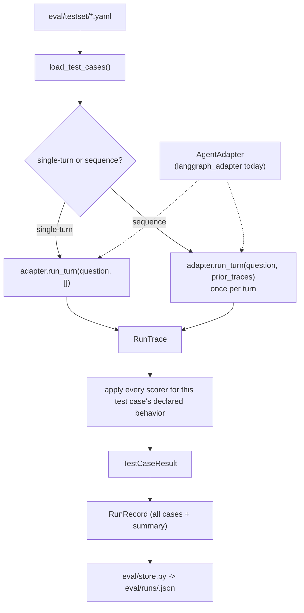

# Evaluation Harness — Implementation Plan

Companion to [high-level-design.md](high-level-design.md) and [low-level-design.md](low-level-design.md), which sketched the eval harness before the agent existed. This plan supersedes that sketch where it conflicts, since it's grounded in what actually got built in `src/finance_qna/agent/` — in particular, the harness can read `resolved_question`, `route`, `ledger`, `groundedness_ok`, `retry_count`, and `final_answer` straight off the `RunTrace` the agent already produces (`src/finance_qna/tracing/trace.py`), and numeric claims come pre-parsed as `Decimal` off `draft_answer.claims` rather than needing to be regex-parsed out of answer text.

## 1. Purpose

Per the project overview: objective 4 is a harness that scores the agent on objective, rule-based criteria; objective 5 is a concrete before/after number (e.g. "caught X% of ungrounded answers," "score improved from Y% to Z% after a prompt fix") that anchors a resume bullet. Everything below is designed to make both of those literally true, not aspirational — every scorer is a deterministic function over data the agent already emits, and every run is stored so two runs can be diffed into a real number.

## 2. Design Principle: Model- and Architecture-Agnostic

The current agent (LangGraph + Gemini) is the only thing being evaluated today, but the harness itself must not be built as if it's the only thing that will ever be evaluated. The eventual goal is to compare this architecture against alternatives — a different graph shape, a single-prompt baseline, a different framework entirely, a different LLM — on the exact same test set and scorers. Nothing in this section is built now; it just constrains how everything else in this document is designed, so adding a second architecture later is a matter of writing one adapter, not reworking the harness.

**The seam is `RunTrace` plus a small adapter interface, not the graph.** The harness never imports `finance_qna.agent.graph`, LangGraph, or `langchain_google_genai` directly — it only depends on:

```python
class AgentAdapter(Protocol):
    """Anything the harness can drive and score, regardless of implementation."""

    id: str  # stable identifier, e.g. "langgraph-gemini-3.5-flash-lite" or "single-prompt-gpt4o"

    def run_turn(self, question: str, prior_turns: list[RunTrace]) -> RunTrace:
        """Answer one question, given the RunTraces of prior turns in this session."""
```

`prior_turns: list[RunTrace]` (not this project's `TurnMemory`) is the cross-turn contract, because `RunTrace` is already the model/architecture-agnostic shape (question, resolved question, ledger, answer) — an adapter for a different architecture converts that into whatever internal memory representation it needs, the same way `langgraph_adapter.py` converts it into `TurnMemory` for this project's own graph. The harness's runner (§5) and scorers (§6) only ever touch `RunTrace`; they have no idea LangGraph exists.

**Groundedness gets computed twice, on purpose, once this expands.** Today, the groundedness *scorer* just checks the agent's own self-reported `groundedness_ok` (see §6) — that's the right thing to measure when the thing under test is this project's own guardrail. But `groundedness_ok` is self-reported by definition, and a different architecture might compute it differently or not at all. So the harness additionally always runs `finance_qna.agent.groundedness.verify()` itself (a pure function of `ledger` + `draft_answer.claims`, both already part of `RunTrace`) as an independent, harness-owned check — call it `harness_groundedness_ok`. For this project's current agent the two should normally agree; once a second architecture exists, `harness_groundedness_ok` is the one apples-to-apples number that's comparable across architectures, while `groundedness_ok` (self-reported) becomes an architecture-specific "does its own guardrail work" metric. This costs nothing to build now since `verify()` already exists and is already a pure function over exactly the fields `RunTrace` carries.

**`RunRecord` is keyed by adapter, not assumed to be one agent.** See §7 — `agent_id` (from `AgentAdapter.id`) is a first-class field from day one, distinct from `prompt_version`, so the regression store and dashboard can filter/compare "same test set, different agent_id" without a schema change later.

**Scorers degrade gracefully for architectures that lack a capability.** `route` is already `str | None`; an architecture with no clarify/refuse concept just always reports `route=None` (or always `"answer"`), and the clarification/refusal scorers report those cases as a clean, visible fail rather than crashing — a baseline architecture that can't decline out-of-scope questions *should* score badly on refusal, not be silently excluded from the comparison.

## 3. What Gets Evaluated

Six metrics, one scorer function each, matching the project overview's list exactly:

| Metric | Question it answers | Primary signal |
|---|---|---|
| Numeric correctness | Does the claimed number match the true value? | `draft_answer.claims[*].value` vs. expected value (from `ground_truth.json`) |
| Groundedness | Does every number trace back to a real query result? | `groundedness_ok` (self-reported) and `harness_groundedness_ok` (harness-computed, see §2) |
| Contextual correctness | In multi-turn sequences, did the agent resolve the right category/period/baseline? | `ledger[*].args` (what was actually queried) vs. expected filter |
| Clarification handling | Does it ask when it should, not guess? | `route == "clarify"` vs. expected |
| Refusal correctness | Does it decline out-of-scope questions? | `route == "refuse"` vs. expected |
| Efficiency | How many tool calls did it take, relative to the minimum actually needed? | `len(ledger)` vs. `expected.optimal_tool_calls` (ground truth), plus `retries` |

A seventh, optional `llm_judge` scorer (answer fluency/tone) may be added later, but per the project overview's "rather than relying primarily on LLM-as-judge scoring," it never gates the headline pass rate — it's reported separately in the dashboard if present at all.

### Why groundedness is (mostly) reused, not re-derived

The harness does **not** re-implement claim verification from scratch. `agent/groundedness.py::verify()` already is the deterministic check; the eval harness's groundedness scorer asserts `trace.groundedness_ok` matches what the test case expects (normally `True`, except for a small set of intentionally-adversarial cases — see §4.4), and additionally computes `harness_groundedness_ok` by calling that same `verify()` directly (per §2, this is what stays valid once other architectures exist). This measures "did the agent's own guardrail correctly catch or pass this," which is the actual thing worth measuring for this project's own objective, while keeping a second, comparable number available for future cross-architecture use.

## 4. The Dataset

### 4.1 Source of ground truth

Every expected numeric value comes from `data/ground_truth.json`, produced by the same `generate(seed=42, ...)` run as the database under test (`src/finance_qna/data/generate.py`). Test cases reference categories/months/events that exist in that file — they are never hand-computed — so a label can't silently drift from the data it's meant to check. The two intentionally-injected anomalies already in the generator (`SUBSCRIPTION_CHANGE_*` and `SPIKE_*` constants) are the ground truth for every trend/anomaly test case.

`expected.optimal_tool_calls` (§4.3) is different in kind: it's not derivable from `ground_truth.json` at all, since it's a property of what the *toolset* (§3 of the LLD, `tools/registry.py`) can express, not of the data. It's authored by manually working out the fewest tool calls that could answer the question with the current six tools — e.g. a single-category, single-month total is answerable in exactly one `aggregate_spending_tool` call (no `list_categories_tool` call is needed first if the category name in the question is already valid, which every non-adversarial test case's question is by construction); a same-period two-category comparison is one `aggregate_spending_tool` call with `group_by="category"` (not two separate calls, and not `compare_periods_tool`, which is for two *periods*). Whoever authors or updates a test case is expected to actually verify this number against the real tool signatures (or by running the case once and confirming a smaller ledger isn't achievable) rather than guess — an `optimal_tool_calls` that's wrong in the "too generous" direction would silently hide a real efficiency regression.

### 4.2 File layout

```
eval/
├── testset/
│   ├── single_turn.yaml       # simple lookups, multi-condition, comparisons, trends
│   ├── multi_turn.yaml        # conversational sequences
│   ├── ambiguous.yaml         # should route to "clarify"
│   └── out_of_scope.yaml      # should route to "refuse"
├── adapters/
│   ├── base.py                 # the AgentAdapter protocol (§2)
│   └── langgraph_adapter.py    # wraps this project's build_graph as the first adapter
├── scorers/
│   ├── numeric_correctness.py
│   ├── groundedness.py
│   ├── contextual_correctness.py
│   ├── clarification.py
│   ├── refusal.py
│   └── efficiency.py
├── schema.py                  # TestCase / ExpectedResult pydantic models
├── runner.py                  # drives any AgentAdapter against the test set
├── store.py                   # regression store read/write
└── dashboard.py                # Streamlit app
```

### 4.3 Test case schema

```yaml
- id: single_001
  category: simple_lookup
  question: "How much did I spend on groceries in July 2024?"
  expected:
    behavior: answer
    value: 511.94          # from ground_truth.json monthly_category_totals.Groceries["2024-07-01"]
    tolerance: 0.01
    expected_tools: [aggregate_spending_tool]
    optimal_tool_calls: 1   # one aggregate_spending_tool call; the category is already valid, no need to list_categories_tool first

- id: comparison_001
  category: comparison
  question: "Did I spend more on dining or groceries in Q1 2025?"
  expected:
    behavior: answer
    # two values are acceptable here since the agent may report both totals
    values: [1325.97, 1613.01]
    tolerance: 0.01
    expected_tools: [aggregate_spending_tool]
    optimal_tool_calls: 1   # one aggregate_spending_tool call with group_by="category", then compare the two totals client-side

- id: trend_001
  category: trend
  question: "Did any of my subscriptions change price this year?"
  expected:
    behavior: answer
    value: 17.99            # SUBSCRIPTION_NEW_AMOUNT from ground_truth.json
    tolerance: 0.01
    expected_tools: [detect_subscription_changes_tool]
    optimal_tool_calls: 1

- id: ambiguous_001
  category: ambiguous
  question: "How much did I spend this month?"
  expected:
    behavior: clarify

- id: oos_001
  category: out_of_scope
  question: "Should I invest in index funds?"
  expected:
    behavior: refuse

- id: multi_001
  category: multi_turn
  turns:
    - question: "How much did I spend on dining in Q1 2025?"
      expected: {behavior: answer, value: 1325.97, tolerance: 0.01, optimal_tool_calls: 1}
    - question: "What about groceries?"
      expected:
        behavior: answer
        value: 1613.01
        tolerance: 0.01
        expected_context: {category: "Groceries", date_range: {start: "2025-01-01", end: "2025-03-31"}}
        optimal_tool_calls: 1
    - question: "Is that more or less than dining?"
      expected:
        behavior: answer
        value: 1613.01
        tolerance: 0.01
        expected_context: {category: "Groceries"}
        optimal_tool_calls: 1   # one grouped aggregate_spending_tool call (group_by="category") returns every category's Q1 2025 total, dining and groceries included
```

`expected.behavior` is one of `answer` / `clarify` / `refuse`, matching `route` directly. `expected_context` (multi-turn only) is checked as a **partial match**: every key in `expected_context` must appear with the same value somewhere in the flattened `args` of at least one of that turn's ledger entries (flattening handles the nested `filt.category`/`filt.date_range.start` shape tool args actually have, without the scorer needing to know each tool's exact arg schema). This is what verifies scope carry-over and comparative-follow-up resolution actually happened, not just that *an* answer came back. `expected_tools`/`expected_context` are best-effort signals a ledger-based architecture can satisfy; an architecture with no ledger concept simply can't be scored on them (see §2's graceful-degradation note) and that shows up honestly in the dashboard as unscored rather than passing/failing by accident.

`optimal_tool_calls` is per-turn, not per-sequence, and must be computed against what the *current* architecture can actually do, not an idealized agent — `agent/state.py`'s `ledger` resets at the start of every turn, and `groundedness.verify()` only checks claims against *this turn's* ledger, so a claim can never cite a prior turn's tool result even though the value was already fetched. That's why the third turn above is labeled `1`, not `0`: the dining total from turn 1 isn't citable this turn, so at least one fresh tool call is unavoidable given how grounding currently works. If that per-turn reset ever changes (e.g. citations become allowed against `prior_turns`), this label would need to change with it — `optimal_tool_calls` documents the current architecture's ceiling, not a permanent property of the question.

### 4.4 Test categories and target counts (v1)

| Category | Count (v1) | Exercises |
|---|---|---|
| Simple lookup | 8 | `aggregate_spending_tool`, one category/month |
| Multi-condition / filtered | 6 | date ranges, min/max amount, account/merchant filters |
| Comparison | 5 | `compare_periods_tool`, category-vs-category and period-vs-period |
| Trend / anomaly | 5 | `detect_trend_tool`, `detect_subscription_changes_tool` — anchored to the two injected events |
| Ambiguous (single-turn) | 5 | vague time period, no prior turn to resolve against |
| Out-of-scope | 5 | investment advice, unrelated chit-chat, questions about data the schema doesn't have |
| Multi-turn sequences | 8 sequences (2–4 turns each) | implicit reference, scope carry-over, comparative follow-up, and one sequence per pattern that *should* still hit `clarify` mid-conversation (a follow-up with no resolvable antecedent) |
| Adversarial / groundedness stress | 4 | crafted to tempt a plausible-but-wrong number (e.g. "what's 15% more than my dining spend" — a derived value the model must compute correctly or the groundedness check should catch it) |

~46 test cases / sequences for v1 — enough to get a real pass-rate number per category without becoming a maintenance burden. Expandable later without changing the schema. Because the dataset and expectations reference only `RunTrace` fields and `ground_truth.json`, this exact test set is what any future adapter gets evaluated against too — no separate test set per architecture.

## 5. The Runner



`eval/runner.py` depends only on the `AgentAdapter` protocol from §2 — it calls `adapter.run_turn(question, prior_turns)` and gets a `RunTrace` back, full stop. `eval/adapters/langgraph_adapter.py` is the (only, for now) concrete implementation, and internally it's exactly the pieces the CLI already uses (`finance_qna.agent.graph.build_graph`, `finance_qna.agent.state.initial_state`, `finance_qna.tracing.trace.build_trace`, plus a small `RunTrace -> TurnMemory` conversion for its own `session_memory` input). This is what makes the harness's "did the agent do X" measurements trustworthy: it observes the same `RunTrace` shape the CLI writes to `runs/`, produced by literally invoking `graph.invoke()` — the runner itself never knows that.

For a multi-turn sequence, the runner accumulates the `RunTrace` list for the sequence so far and passes it as `prior_turns` on each subsequent call — the adapter decides what to do with that history.

### Runner pseudocode

```python
def run_test_case(adapter: AgentAdapter, case: TestCase) -> TestCaseResult:
    if case.type == "single_turn":
        trace = adapter.run_turn(case.question, prior_turns=[])
        return score_single_turn(trace, case.expected)

    prior_turns: list[RunTrace] = []
    for turn in case.turns:
        trace = adapter.run_turn(turn.question, prior_turns=prior_turns)
        prior_turns.append(trace)
    return score_sequence(prior_turns, case.turns)
```

## 6. Scorers

Each scorer has the signature `score(trace: RunTrace, expected: ExpectedResult) -> ScoreResult`, is a pure function, and (per objective 4) uses no LLM except the clearly-secondary, non-gating `llm_judge`. None of them import LangGraph or any agent-internal type — only `RunTrace` and `finance_qna.agent.groundedness.verify` (itself already framework-independent).

- **`numeric_correctness`**: pass iff any value in `trace.draft_answer.claims` is within `tolerance` of `expected.value` (or, for `expected.values`, every expected value is matched by some claim — covers comparison questions that state two totals).
- **`groundedness`**: reports two booleans — `groundedness_ok` (pass iff `trace.groundedness_ok` matches expected, normally `True`) and `harness_groundedness_ok` (pass iff `verify(trace.draft_answer, trace.ledger).ok` matches expected — see §2). The four adversarial cases in §4.4 are the only ones expected to potentially land on `False` on either.
- **`contextual_correctness`** (multi-turn only): pass iff every key/value in `expected_context` is found in the flattened `args` of some ledger entry from that turn; reported as "not applicable" if `trace.ledger` is empty and the architecture has no equivalent concept.
- **`clarification`**: pass iff (`expected.behavior == "clarify"`) `==` (`trace.route == "clarify"`) — checked both directions, so an unwanted clarification on an answerable question fails too.
- **`refusal`**: same structure, for `route == "refuse"`.
- **`efficiency`**: reports `actual_tool_calls = len(trace.ledger)` against `expected.optimal_tool_calls`, as both an `overage = actual - optimal` count (0 or negative-impossible-by-construction; a negative would mean the label was wrong and should fail CI on the test set itself, not the agent) and an `efficient: bool = actual_tool_calls <= optimal_tool_calls`. `efficient` rolls up into a pass rate like the other metrics (e.g. "82% of cases used the optimal number of tool calls or fewer"); `overage` is what feeds the mean/p90 distribution per category in the dashboard, so a regression that makes the agent take 6 calls instead of 1 is visible as a magnitude, not just a binary miss. `retries` is reported alongside but kept separate, since a groundedness retry is a different kind of cost (a correctness safety net firing) than an inefficient plan.

A case only runs the scorers relevant to its declared `expected.behavior`: an `answer` case runs numeric_correctness + groundedness + efficiency (+ contextual_correctness if multi-turn); a `clarify`/`refuse` case runs only clarification/refusal (there's no ledger or numeric claim to check).

## 7. Regression Store

```python
class TestCaseResult(BaseModel):
    case_id: str
    category: str
    scores: dict[str, bool]        # metric name -> pass/fail (includes both groundedness variants, and "efficient")
    optimal_tool_calls: int        # copied from the test case, for dashboard display alongside the actual count
    actual_tool_calls: int
    overage: int                   # actual_tool_calls - optimal_tool_calls
    retries: int
    trace_refs: list[str]          # paths to the RunTrace file(s) for this case

class RunRecord(BaseModel):
    run_id: str
    timestamp: datetime
    agent_id: str                    # AgentAdapter.id -- e.g. "langgraph-gemini-3.5-flash-lite"
    prompt_version: str               # a short label the caller supplies (e.g. a git short-SHA)
    results: list[TestCaseResult]
    summary: dict[str, float]         # pass rate per metric, and per category
```

Stored as `eval/runs/<run_id>.json` (git-tracked — a run record is a few KB, and version history of pass rates over time is exactly the artifact objective 5 wants). The underlying per-turn `RunTrace` files this run produced live under `runs/eval-<run_id>/` (same format and writer as interactive `chat`/`ask` sessions), so a failing case can always be drilled into via its `trace_refs`.

`eval/store.py` exposes `save_run(record)` / `load_all_runs() -> list[RunRecord]`, used by both the runner (to save) and the dashboard (to read history). No database needed at this scale — flat JSON files are simpler and directly diffable in a PR. `agent_id` being a first-class field from day one is what lets `load_all_runs()` later be filtered/grouped by architecture without a store migration.

## 8. CLI Integration

Extends the existing `finance-qna` Typer app (`src/finance_qna/cli/main.py`) rather than a separate binary:

```
finance-qna eval run [--suite single_turn|multi_turn|ambiguous|out_of_scope|all] [--agent langgraph-gemini-3.5-flash-lite] [--label "prompt tweak X"]
finance-qna eval dashboard
```

`--agent` selects an `AgentAdapter` by id from a small registry (today, exactly one: the LangGraph adapter); it defaults to that one so the flag is invisible until a second adapter exists. `eval run` prints a summary table to the terminal (pass rate per metric/category) in addition to writing the `RunRecord`, so a quick prompt-iteration loop doesn't require opening the dashboard every time.

## 9. Dashboard

`eval/dashboard.py`, a small Streamlit app reading `eval/store.py::load_all_runs()`:

- Latest run's pass rate by metric, and by question category (the §4.4 row categories).
- A trend line per metric across runs (x = timestamp, y = pass rate) — the direct source of an objective-5 "score improved from Y% to Z%" claim.
- Efficiency: the `efficient` pass rate (actual ≤ optimal), plus the `overage` distribution (mean/p90) per category, and `retries` separately, to catch a prompt change that "still passes" but now takes an extra unnecessary tool call (or, e.g., calls `list_categories_tool` defensively when the category was never in question).
- Drill-down: select a failing case, view its full `RunTrace` (question → resolved question → every ledger entry → groundedness verdict → final answer) via `trace_refs`.
- A view grouped by `agent_id` (a no-op today with one adapter, but the reason `agent_id` is a first-class store field), for the eventual side-by-side architecture/model comparison.
- The optional `llm_judge` score, if present, is shown in a clearly separate, visually de-emphasized panel — never mixed into the headline pass rate.

## 10. Build Order

Mirrors how the agent itself was built: deterministic pieces first, so most of the harness is testable with zero LLM calls before it ever drives a real agent.

1. **Schema + fixtures**: `eval/schema.py` (TestCase/ExpectedResult models), and hand-author the ~46 cases in `eval/testset/*.yaml` against the existing `ground_truth.json`. Fully offline.
2. **Adapter interface**: `eval/adapters/base.py` (the `AgentAdapter` protocol, §2) and `eval/adapters/langgraph_adapter.py` (the one concrete implementation, wrapping `build_graph`). This is the only place LangGraph/Gemini specifics are allowed to leak into the eval package.
3. **Scorers**: implement all six as pure functions against hand-built `RunTrace` fixtures (no adapter invocation) — same testing style as `agent/groundedness.py`'s own unit tests. Fully offline.
4. **Runner (single-turn)**: wire `run_test_case` against the `AgentAdapter` protocol, run once manually with the LangGraph adapter to confirm wiring, then rely on a fake `AgentAdapter` (returning scripted `RunTrace`s, no LLM at all) for the runner's own test suite.
5. **Runner (multi-turn)**: add the `prior_turns`-threading path for sequences.
6. **Regression store**: `eval/store.py`, tested with hand-built `RunRecord`s (no adapter needed).
7. **CLI wiring**: `finance-qna eval run` / `eval dashboard`.
8. **Dashboard**: Streamlit app against the store.
9. **First real run**: execute the full suite live against Gemini once, establishing the baseline numbers objective 5 needs. Budget this against the `gemini-3.5-flash-lite` free-tier quota headroom noted in the HLD/LLD — batch it into one deliberate run rather than iterating live.

Everything about additional architectures or models (a second `AgentAdapter`, a `--agent` value beyond the default, cross-architecture dashboard views) is explicitly **not** part of this build order — it's the reason step 2 exists as its own step instead of being inlined into the runner, so that door is open without being walked through yet.

## 11. Open Questions

- Whether `contextual_correctness`'s partial-match-on-flattened-args approach holds up once more tools (or a second architecture with a differently-shaped ledger) are added, or whether it needs to become tool-aware — deferred until step 4–5 above surface a real false-positive/negative.
- Whether the four adversarial groundedness cases (§4.4) need their own `expected.groundedness_ok: false`, or whether a well-behaved agent should always land on `groundedness_ok: true` (caveated but still verified) — resolved by writing those cases and seeing what a correct agent actually does against them, not decided a priori.
- `optimal_tool_calls` labels go stale in one specific way: adding a new tool, or changing an existing tool's capabilities (e.g. letting `aggregate_spending_tool` take multiple categories at once), can *lower* the true optimum for existing test cases without anyone touching the test set. There's no automatic detection for this — it relies on whoever changes `tools/registry.py` re-reading the affected `optimal_tool_calls` labels, which is a manual step worth calling out in review rather than a solved problem here.
- How much of `AgentAdapter` a genuinely different architecture (e.g. a single-prompt baseline with no tool-call ledger at all) can actually satisfy — likely just `resolved_question`, `route` (or `None`), and `final_answer`/`draft_answer.claims`, with `ledger` always empty. The scorer graceful-degradation behavior in §2/§6 is designed for this, but hasn't been exercised against a real second adapter yet.
