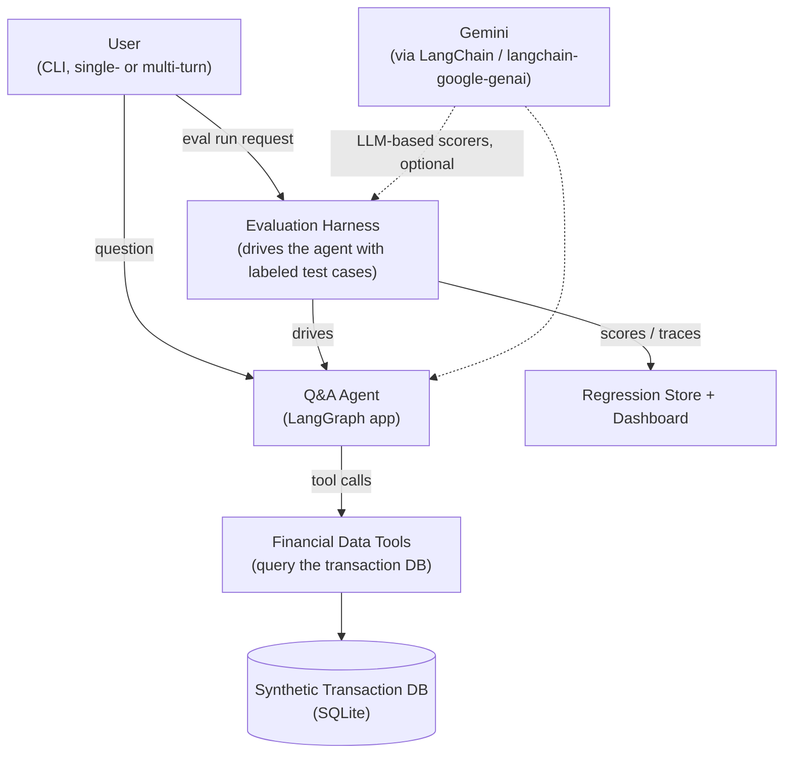

# High-Level Design — Personal Financial Statement Q&A Agent

## 1. Purpose

This document describes the system architecture for a financial Q&A agent that answers natural-language questions about synthetic personal transaction data, and the evaluation harness used to measure and improve its correctness. It is the parent design for [low-level-design.md](low-level-design.md), which specifies interfaces, schemas, and algorithms for each subsystem below.

Two properties drive every architectural decision in this document:

- **Deterministic ground truth.** Every question in this domain has a computable correct answer, so the system is built to make verification cheap: structured tools instead of free-text SQL, a citation ledger instead of trust, rule-based scorers instead of LLM-as-judge as the primary signal.
- **No unnecessary complexity.** The agent needs to reason, call tools, hold conversational state, and cite its sources. It does not need multi-agent orchestration, vector search, or a general-purpose planner. The design deliberately stays a single LangGraph agent with a small, well-typed toolset.

## 2. System Context

## 3. Subsystem Overview

| # | Subsystem | Responsibility |
|---|-----------|-----------------|
| 1 | Data Layer | Generates and stores synthetic transaction data; defines the schema all tools query against |
| 2 | Tool Layer | A small set of typed, deterministic functions the agent calls to read the data — the agent's *only* path to numbers |
| 3 | Agent Core | LangGraph state machine: plans, calls tools, resolves conversational context, decides to answer/clarify/refuse, checks its own groundedness before responding |
| 4 | Conversational Memory | Structured per-session state (not just chat history) that lets follow-up questions resolve category/time/comparison scope correctly |
| 5 | Groundedness & Citation | Every numeric token in a final answer is checked against the ledger of tool results produced during that turn |
| 6 | Interface Layer | CLI for interactive single/multi-turn sessions and for scripted eval runs |
| 7 | Observability | Structured run traces (plan → tool calls → citations → answer) persisted per turn, viewable and reusable by the eval harness |
| 8 | Configuration & Model Provider | Central config for the Gemini model, prompts, and tool registry; isolates the rest of the system from the LLM provider |
| 9 | Evaluation Harness | Labeled test set, rule-based scorers per objective from the overview, a runner that drives the agent, a regression store, and a dashboard |

Subsystems 1–8 make up the **Q&A Agent**. Subsystem 9 is the **Evaluation Harness**, built second, against the finished agent's public interface (subsystem 6/8), per the project's stated build order.

## 4. Agent Core — Design Approach

The agent is a single **LangGraph** `StateGraph`, not a multi-agent system. A financial-lookup question does not need a supervisor/worker split; it needs one reasoning loop with tight guardrails around what counts as a valid, grounded answer.

Design choice: **structured tools over text-to-SQL.** The agent does not write raw SQL. It calls typed tools (`get_transactions`, `aggregate_spending`, `compare_periods`, `detect_trend`, ...) with validated arguments (category enum, ISO date ranges, comparison mode). This is the single most important decision in the system, because it is what makes objectives 2 and 4 (traceable numeric claims, rule-based scoring) tractable:

- A raw SQL tool means the eval harness would need a SQL-equivalence checker to know if two queries mean the same thing. A structured tool call is already a normalized, comparable object (tool name + args), which the eval harness can diff directly against a labeled expected call.
- Structured tools can validate/reject an invalid category or malformed date range before hitting the database, giving the agent a clean error to reason about instead of a SQL exception.
- It bounds the agent's action space, which bounds prompt-injection-via-data and runaway query cost.

High-level turn flow (detailed node graph in the LLD):

1. **Contextualize** — given the new question and the session's structured memory, resolve implicit references ("what about April" → same category, new month) into a self-contained, resolved question. If resolution is ambiguous, this step flags it rather than guessing.
2. **Route** — classify the resolved question as: answerable (needs tool calls), out-of-scope (refuse), or ambiguous (clarify). This is a lightweight LLM classification, not a separate agent.
3. **Plan & act (ReAct loop)** — the agent reasons and calls one or more tools, observing structured results after each call, until it has enough data to answer or decides it cannot.
4. **Groundedness check** — before returning, every numeric claim in the draft answer is verified against the tool-call ledger for this turn. Unsupported numbers force a retry (re-plan) or a downgraded, caveated answer rather than a silent hallucination.
5. **Respond** — return the answer, the reasoning/query trace (for transparency), and update the session's structured memory with what was just resolved, so the next turn can build on it.

This flow directly implements objectives 1–3 and feature list items around clarification, refusal, and transparent reasoning.

## 5. Conversational Memory — Design Approach

Chat history (the raw list of prior messages) is necessary but not sufficient for objective 3. The feature list calls out three distinct reference-resolution patterns (implicit reference, scope carry-over, comparative follow-up), which all require knowing *what the last answer actually was*, not just what was said. The design therefore keeps two things per session:

- **Message history** — passed to the LLM for natural conversational flow.
- **Structured turn memory** — a small, explicit record per turn of (resolved question, tool calls made, key results, e.g. "category=dining, period=Q1 2025, total=$1,240"). This is what the Contextualize step actually resolves against, because it's unambiguous in a way that free text isn't.

This is scoped to a single session per the stated non-goal (no cross-session memory) — the structured memory lives in process/session state, not a persisted store.

## 6. Groundedness & Citation — Design Approach

Objective 2 ("every numeric claim traceable to a query result") is enforced structurally, not by prompting alone:

- Every tool call and its raw result is appended to a per-turn **ledger**.
- The final-answer generation step is asked to produce numbers *only* by reference to ledger entries (structured output: answer text + a list of `{value, ledger_ref}` claims), rather than free-form prose the system then has to parse.
- A deterministic post-check confirms every claimed value equals (within float tolerance) some ledger value or a simple arithmetic combination of ledger values (sum/difference/percentage) — this is what lets the eval harness score groundedness as a rule-based pass/fail rather than an LLM judgment call.

## 7. Evaluation Harness — Design Approach

Built after the agent, against its trace output (subsystem 7) so it never needs special hooks into the agent's internals. Four components:

- **Labeled test set**: question(s) + expected structured answer (value, tolerance, expected tool calls/args, expected behavior: answer/clarify/refuse) + expected resolved-reference for multi-turn sequences.
- **Scorers**: one deterministic function per objective-5 metric (numeric correctness, groundedness, contextual correctness, clarification handling, refusal correctness, efficiency). LLM-as-judge is used only as a secondary, optional signal (e.g., answer fluency), never for the primary metrics.
- **Runner**: drives the agent (single-turn and scripted multi-turn sequences) against the test set, collects traces, applies scorers, writes a run record.
- **Regression store + dashboard**: append-only run records (JSON/SQLite) keyed by run id, prompt/model version; a small dashboard (Streamlit) shows pass rate by category and score trend across runs, so a prompt or model change has a before/after number — objective 5's resume-bullet requirement.

## 8. Technology Stack

| Concern | Choice | Rationale |
|---|---|---|
| Language | Python 3.11+ | project requirement |
| LLM | Google Gemini (e.g. `gemini-flash-latest` / `gemini-pro-latest`) | project requirement |
| LLM orchestration | LangChain (`langchain-google-genai`) + LangGraph | project requirement; LangGraph gives explicit, inspectable state-machine control over the ReAct/groundedness loop instead of a custom orchestrator |
| Structured I/O | Pydantic v2 | tool argument/result schemas, structured LLM output (`with_structured_output`) |
| Data store | SQLite | zero-ops, trivially portable, sufficient for a single synthetic dataset; queried only through the tool layer, never directly by the LLM |
| Synthetic data generation | Python + `faker` (or hand-rolled generators) | portfolio-safe data per non-goals |
| CLI | `typer` or `argparse` | minimal interface per non-goals |
| Eval regression store | SQLite/JSON files under version control | simple, diffable, no external infra |
| Dashboard | Streamlit | fastest path to a usable local dashboard |
| Tracing | LangGraph's built-in run/state capture, optionally LangSmith | transparency requirement without building custom infra |

## 9. Key Design Decisions & Tradeoffs

1. **Structured tools, not text-to-SQL.** Trades some flexibility (agent can't express arbitrary queries) for evaluability and safety. Acceptable because the question space (aggregation, comparison, trend) is enumerable and the eval harness's rule-based scoring depends on it.
2. **Single LangGraph agent, not multi-agent.** The task doesn't decompose into independent roles; a supervisor/worker split would add coordination complexity with no accuracy benefit.
3. **Structured turn memory alongside chat history**, instead of relying on the LLM to infer context from raw transcript. Costs a bit of extra state-management code; buys reliable reference resolution, which is otherwise the hardest failure mode in multi-turn agents.
4. **Post-hoc structural groundedness check**, instead of trusting the model's citations. Cheap to implement given structured tool outputs, and is the mechanism that makes "caught X% of ungrounded answers" (objective 5) a measurable, honest claim rather than a marketing number.
5. **Rule-based scoring as primary, LLM-as-judge as secondary.** Matches objective 4 directly; LLM-judge is kept available for softer qualities (tone, clarity) but never gates correctness metrics.

## 10. Non-Goals (carried from project overview)

- No real personal financial data — synthetic only.
- No cross-session persistence of conversational memory.
- No production deployment/UI — CLI only.

## 11. Open Questions for LLD

- Exact Gemini model(s) for the agent loop vs. cheaper models for classification/routing sub-steps.
- Whether trend/anomaly detection needs a dedicated statistical tool (e.g., month-over-month % change with a threshold) versus being expressed as compositions of the aggregation tool — resolved in LLD §4.
