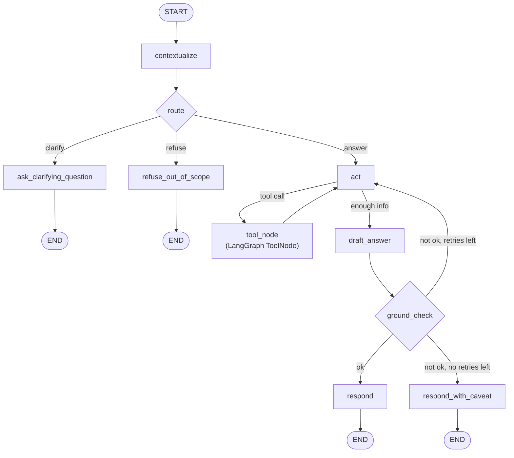

# Low-Level Design — Personal Financial Statement Q&A Agent

Companion to [high-level-design.md](high-level-design.md). This document specifies module layout, schemas, the LangGraph state machine, prompts, and algorithms concretely enough to implement directly.

## 1. Repository Layout

```
finance-qna-agent/
├── design/
│   ├── project-overview.md
│   ├── high-level-design.md
│   └── low-level-design.md
├── src/
│   └── finance_qna/
│       ├── config.py                # Settings (pydantic-settings), model factory
│       ├── data/
│       │   ├── schema.py            # SQLAlchemy table defs / DDL
│       │   ├── generate.py          # synthetic data generator
│       │   └── db.py                # engine/session helpers
│       ├── tools/
│       │   ├── models.py            # pydantic arg/result schemas shared by all tools
│       │   ├── query_tools.py       # get_transactions, aggregate_spending, list_categories
│       │   ├── compare_tools.py     # compare_periods
│       │   └── trend_tools.py       # detect_trend, detect_price_change
│       ├── agent/
│       │   ├── state.py             # AgentState TypedDict, TurnMemory, Ledger
│       │   ├── graph.py             # LangGraph StateGraph assembly
│       │   ├── nodes.py             # node functions: contextualize, route, act, ground_check, respond
│       │   ├── prompts.py           # system/task prompt templates
│       │   ├── groundedness.py      # claim extraction + ledger verification
│       │   ├── adapter.py           # AgentAdapter protocol + build_adapter factory (see §6.1)
│       │   └── langgraph_adapter.py # LangGraphAdapter + LangGraphAgentConfig, the one concrete adapter
│       ├── tracing/
│       │   └── trace.py             # RunTrace schema + writer (JSON per turn)
│       └── cli/
│           └── main.py              # typer app: `chat`, `ask`, `eval run`
├── eval/
│   ├── testset/
│   │   ├── single_turn.yaml
│   │   ├── multi_turn.yaml
│   │   ├── ambiguous.yaml
│   │   └── out_of_scope.yaml
│   ├── scorers/
│   │   ├── numeric_correctness.py
│   │   ├── groundedness.py
│   │   ├── contextual_correctness.py
│   │   ├── clarification.py
│   │   ├── refusal.py
│   │   └── efficiency.py
│   ├── runner.py                    # drives agent against testset, writes run record
│   ├── store.py                     # regression store read/write
│   └── dashboard.py                 # Streamlit app
├── data/
│   └── synthetic_transactions.db    # generated, gitignored (or checked in as fixed seed for reproducibility)
├── tests/                           # unit tests for tools, nodes, scorers
├── pyproject.toml
└── README.md
```

## 2. Data Layer

### 2.1 Schema (SQLite via SQLAlchemy Core)

```
accounts(account_id PK, name, type)                # e.g. "Checking", "Credit Card"
categories(category_id PK, name, parent_category_id NULL)  # e.g. "Dining" under "Food"
merchants(merchant_id PK, name, default_category_id FK)
transactions(
    transaction_id PK,
    account_id FK,
    merchant_id FK,
    category_id FK,          # denormalized at transaction time; a merchant's default can drift
    date DATE,
    amount DECIMAL,          # positive = expense, negative = refund/credit, by convention
    description TEXT,
    is_subscription BOOLEAN  # supports the "did any subscription price change" feature
)
```

Design notes:
- `category_id` is stored per-transaction (not just derived from merchant) so category reassignment over time doesn't rewrite history — needed for realistic trend questions.
- `is_subscription` plus repeated `merchant_id` + roughly-monthly cadence is what the trend tool uses to detect subscription price changes (§4.3).
- Amounts stored as `DECIMAL`/`NUMERIC` (via Python `Decimal`), never float, so numeric-correctness scoring in the eval harness isn't fighting floating-point drift.

### 2.2 Synthetic Data Generator (`data/generate.py`)

- Deterministic given a seed (`--seed 42`) so the dataset — and therefore the eval harness's ground truth — is reproducible.
- Generates 12–24 months of transactions across a fixed set of categories (Food/Dining, Food/Groceries, Transport, Housing, Utilities, Entertainment, Subscriptions, Shopping, Health, Income).
- Injects known, labeled anomalies/trends on purpose, e.g.:
  - a subscription (`is_subscription=True`) that increases price at a known date — ground truth for trend-detection test cases.
  - a category with a deliberate spend spike in one month — ground truth for anomaly test cases.
- Writes directly to `data/synthetic_transactions.db`. The generator also emits a `data/ground_truth.json` sidecar of computed aggregates (monthly totals per category, known trend events) that the eval test-set authoring process reads from, so labels are derived from the same generation run rather than hand-computed and possibly wrong.

## 3. Tool Layer

All tools are plain Python functions wrapped with LangChain's `@tool` decorator (or `StructuredTool.from_function`), with Pydantic `args_schema`. They are the *only* code path that touches the database.

### 3.1 Common types (`tools/models.py`)

```python
class DateRange(BaseModel):
    start: date
    end: date  # inclusive

class TransactionFilter(BaseModel):
    category: str | None = None          # must match categories.name (validated against a live enum)
    date_range: DateRange
    account: str | None = None
    merchant: str | None = None
    min_amount: Decimal | None = None
    max_amount: Decimal | None = None

class AggregateResult(BaseModel):
    total: Decimal
    count: int
    filter_applied: TransactionFilter
    ledger_id: str   # unique id assigned when this result is appended to the turn ledger
```

`category` is validated against `list_categories()` output at call time (via a Pydantic validator that receives the live category set through context), so an invalid category is rejected before querying — the agent gets a structured error ("no such category: 'Coffee'; did you mean 'Dining'?") to reason about.

### 3.2 Tools

| Tool | Args | Returns | Purpose |
|---|---|---|---|
| `list_categories` | — | `list[str]` | lets the agent ground category names before filtering |
| `get_transactions` | `TransactionFilter`, `limit` | `list[Transaction]` | raw rows, for "show me" style or small result sets |
| `aggregate_spending` | `TransactionFilter`, `group_by: Literal["none","category","month"]` | `AggregateResult` or list thereof | the primary tool for "how much did I spend on X" |
| `compare_periods` | `category: str\|None`, `period_a: DateRange`, `period_b: DateRange` | `CompareResult{total_a, total_b, diff, pct_change}` | "did I spend more on dining or groceries", "vs last year" |
| `detect_trend` | `category: str\|None`, `date_range: DateRange`, `granularity: Literal["month","quarter"]` | `TrendResult{series: list[(period, total)], direction, pct_change}` | trend questions |
| `detect_subscription_changes` | `date_range: DateRange` | `list[SubscriptionChangeEvent{merchant, old_amount, new_amount, change_date}]` | "did any subscription price change" |

Every tool result carries a `ledger_id`; nodes append `(tool_name, args, result, ledger_id)` to `AgentState.ledger` immediately after invocation (done centrally in the `act` node, not inside each tool, so it can't be forgotten by a future tool author).

### 3.3 SQL execution

Each tool builds a parameterized SQLAlchemy query from its validated Pydantic args — never string concatenation — eliminating SQL injection regardless of what's in `description`/free-text fields.

## 4. Agent Core — LangGraph State Machine

### 4.1 State (`agent/state.py`)

```python
class LedgerEntry(TypedDict):
    ledger_id: str
    tool_name: str
    args: dict
    result: dict            # tool result, JSON-serializable
    timestamp: str

class TurnMemory(TypedDict):
    turn_id: int
    raw_question: str
    resolved_question: str
    category: str | None
    date_range: DateRangeDict | None
    comparison_baseline: dict | None   # what a prior "compare" resolved to, for "is that more than..."
    key_results: dict                  # small denormalized summary for cheap reference resolution

class AgentState(TypedDict):
    messages: list[BaseMessage]        # full chat history, for LLM context
    session_memory: list[TurnMemory]   # structured memory, one entry per completed turn
    current_question: str
    resolved_question: str | None
    route: Literal["answer", "clarify", "refuse"] | None
    ledger: list[LedgerEntry]          # reset at the start of each turn
    draft_answer: StructuredAnswer | None
    groundedness_ok: bool
    retry_count: int
    final_answer: str | None
```

### 4.2 Graph (`agent/graph.py`)



Nodes:

- **`contextualize`** — LLM call with `resolved_question` as structured output (`{resolved_question: str, is_ambiguous: bool, ambiguity_reason: str | None}`), given `current_question`, last 1–2 `TurnMemory` entries, and recent `messages`. Implements the three follow-up patterns from the feature list by explicitly prompting the model to check: (a) does this question use "that"/"it"/an implicit time or category — resolve from the most recent `TurnMemory`; (b) is a scope narrowing implied ("just groceries") — inherit unspecified fields from prior `TurnMemory`; (c) is this a comparison against a prior *answer* — pull `key_results` from the referenced `TurnMemory` as `comparison_baseline`. If resolution is underdetermined (e.g., two plausible prior turns, or a totally new pronoun with no antecedent), sets `is_ambiguous=True`.
- **`route`** — if `contextualize` already flagged ambiguity → `"clarify"`. Otherwise a lightweight structured-output LLM call classifies `resolved_question` as in-scope-answerable vs. out-of-scope (`{route: "answer"|"refuse", reason}`), using a short rubric in the prompt (in scope = about the user's transactions/spending/categories/accounts in the dataset; out of scope = anything else, e.g. investment advice, general chit-chat, questions about data the schema doesn't have).
- **`act`** — standard LangGraph ReAct step: LLM bound to the tool list via `.bind_tools(...)` proposes a tool call (or decides it has enough information and proposes `draft_answer`); a `ToolNode` executes it; results are appended to `ledger`. Loops until the model stops calling tools or a max-steps guard trips (feeds the "efficiency" eval metric — step count is read straight off `ledger` length).
- **`draft_answer`** — structured-output call producing `StructuredAnswer{text: str, claims: list[{value: Decimal, ledger_id: str, computation: str | None}]}`. The prompt requires every numeric value in `text` to have a matching entry in `claims`, and every `claims[i].ledger_id` to reference an id actually present in `ledger` (the id list is injected into the prompt so the model can only cite real entries).
- **`ground_check`** — deterministic, no LLM (see §5). Sets `groundedness_ok`.
- **`respond` / `respond_with_caveat`** — finalize `final_answer` from `draft_answer.text`; on caveat path, prepend a disclosure ("I could not fully verify one of the figures below") rather than silently emitting an unverified number. Append a new `TurnMemory` to `session_memory` summarizing what was resolved (category/date_range/key_results) for future-turn reference resolution.
- **`ask_clarifying_question` / `refuse_out_of_scope`** — short templated LLM calls that produce a direct question or a polite decline; no tool calls, no ledger, no `TurnMemory` append (nothing was actually resolved, so nothing should be treated as prior context by a later turn — though the raw message is still added to `messages` for conversational continuity).

### 4.3 Trend/Anomaly design decision (resolves HLD open question)

Two dedicated tools rather than composing `aggregate_spending` calls in-prompt:
- `detect_trend`: computes a time series server-side (SQL `GROUP BY` month/quarter) and returns direction + % change — keeps arithmetic (which the eval harness must check exactly) out of the LLM's hands.
- `detect_subscription_changes`: purpose-built query over `is_subscription=True` transactions grouped by merchant, comparing consecutive amounts — this is a pattern (recurring merchant, amount delta) that would be error-prone for the LLM to assemble from raw transactions but is a trivial deterministic SQL query. Both return already-computed, ledger-citable numbers, consistent with the groundedness design.

## 5. Groundedness Verification (`agent/groundedness.py`)

Pure function, no LLM, called by the `ground_check` node:

```python
def verify(draft: StructuredAnswer, ledger: list[LedgerEntry], tol: Decimal = Decimal("0.01")) -> GroundCheckResult:
    ledger_values = {entry["ledger_id"]: extract_numeric_fields(entry["result"]) for entry in ledger}
    unsupported = []
    for claim in draft.claims:
        candidates = ledger_values.get(claim.ledger_id, [])
        if not any(abs(v - claim.value) <= tol for v in candidates):
            # allow simple derived arithmetic (sum/diff/pct) across ALL ledger values as a fallback
            if not matches_derived_value(claim.value, ledger_values, tol):
                unsupported.append(claim)
    return GroundCheckResult(ok=not unsupported, unsupported=unsupported)
```

`extract_numeric_fields` walks the known result schemas (`AggregateResult.total`, `CompareResult.diff`, etc.) rather than doing generic dict traversal, so it stays exact and typed. `matches_derived_value` checks a small fixed set of combinations (a+b, a-b, a/b*100) across pairs of ledger values — enough for "is that more or less" style claims — and is intentionally not a general expression evaluator, to keep the check deterministic and auditable.

## 6. Conversational Memory and the Agent Adapter

Conversational memory is not its own module (an earlier version of this design had a standalone `memory/session.py::SessionMemory` class; it was removed once the pieces below made it redundant). Instead, cross-turn state is just `list[RunTrace]`, held by whoever is driving the agent (the CLI's `chat` loop, or the eval runner) and passed as `prior_turns` to each call — never persisted to disk, matching the non-goal of no cross-session memory.

### 6.1 `agent/adapter.py` — the `AgentAdapter` protocol

```python
class AgentAdapter(Protocol):
    id: str
    def run_turn(self, question: str, prior_turns: list[RunTrace]) -> RunTrace: ...

def build_adapter(settings: Settings) -> AgentAdapter: ...
```

This exists because the CLI and the (planned) eval harness both need to run a turn without knowing LangGraph exists — see design/eval-harness-plan.md §2 for the full rationale. `build_adapter` is the one place that branches on `settings.agent_architecture` to construct a concrete adapter; today there's exactly one branch.

### 6.2 `agent/langgraph_adapter.py` — the one concrete adapter

`LangGraphAdapter.run_turn` is what used to be `SessionMemory` plus the CLI's turn-running logic, combined: given `prior_turns: list[RunTrace]`, it takes the last `recent_turns` (default 2) entries whose `route == "answer"`, converts each into this graph's own `TurnMemory` via `tracing.trace.turn_memory_from_trace`, and passes that as `session_memory` into `initial_state`. After `graph.invoke()` returns, it converts the resulting `AgentState` into a `RunTrace` via `build_trace` — so `AgentState`/`TurnMemory` never leave this module.

`LangGraphAgentConfig` (also in this module) owns everything specific to this architecture — both model roles, the tool-loop step limit, the groundedness retry limit — loaded from `LANGGRAPH_*`-prefixed environment variables, deliberately separate from the universal `Settings` in `config.py` (§8). A different architecture would define its own config with its own fields instead of extending this one.

## 7. Prompts (`agent/prompts.py`)

- `SYSTEM_PROMPT`: defines the assistant's role, the fixed category vocabulary, and hard rules ("only state a number if it came from a tool result", "ask instead of guessing when a time period or category reference is unclear", "decline politely if the question isn't about the user's transaction data").
- Each node with an LLM call has its own narrow prompt template (contextualize, route, draft_answer, clarify, refuse) rather than one giant prompt — keeps structured-output schemas small and each call's failure mode easy to isolate and eval independently.
- All LLM calls go through `.with_structured_output(PydanticModel)` (Gemini function-calling under the hood via `langchain-google-genai`) — no hand-parsed free text anywhere in the control flow.

## 8. Configuration (`config.py` + per-architecture config)

`Settings` holds only what's universal across every architecture — it must never grow a field that only one architecture cares about (see design/eval-harness-plan.md §2):

```python
class Settings(BaseSettings):
    google_api_key: SecretStr
    agent_architecture: str = "langgraph"  # which AgentAdapter build_adapter() constructs
    db_path: Path = Path("data/synthetic_transactions.db")
    model_config = SettingsConfigDict(env_file=".env")
```

Everything architecture-specific lives with that architecture instead. For the LangGraph architecture, that's `LangGraphAgentConfig` in `agent/langgraph_adapter.py` (§6.2):

```python
class LangGraphAgentConfig(BaseSettings):
    agent_model: str = "gemini-3.5-flash-lite"        # act, draft_answer, clarify, refuse
    classifier_model: str = "gemini-3.5-flash-lite"    # contextualize, route (cheaper model candidate)
    max_tool_steps: int = 6
    groundedness_retry_limit: int = 1
    model_config = SettingsConfigDict(env_file=".env", env_prefix="LANGGRAPH_")
```

A `get_llm(model_name: str) -> BaseChatModel` factory in `config.py` centralizes `ChatGoogleGenerativeAI` construction so model choice is swappable without touching node logic; it takes a plain model id string, not a `Settings` field, so any architecture's own config can call it. `build_adapter` (§6.1) is what the CLI and eval harness both call to get a ready-to-use `AgentAdapter` — neither one calls `get_llm`, `build_graph`, or reads `LangGraphAgentConfig` directly.

## 9. Tracing (`tracing/trace.py`)

```python
class RunTrace(BaseModel):
    turn_id: str
    question: str
    resolved_question: str
    route: str
    ledger: list[LedgerEntry]
    draft_answer: StructuredAnswer | None
    groundedness_ok: bool
    retries: int
    final_answer: str
    latency_ms: int
```

Written as one JSON file per turn under `runs/<session_id>/<turn_id>.json` in interactive mode, and held in-memory and passed directly to scorers in eval mode (no disk round-trip needed there). This is the "reasoning/query transparency" feature and is also the sole input the eval harness needs — it never reaches into agent internals directly.

## 10. Evaluation Harness

### 10.1 Test case schema (`eval/testset/*.yaml`)

```yaml
- id: single_001
  type: single_turn
  question: "How much did I spend on groceries in March 2025?"
  expected:
    behavior: answer
    value: 412.30
    tolerance: 0.01
    expected_tool_calls: ["aggregate_spending"]

- id: multi_002
  type: multi_turn
  turns:
    - question: "How much did I spend on dining last quarter?"
      expected: {behavior: answer, value: 1240.50, tolerance: 0.01}
    - question: "What about groceries?"
      expected:
        behavior: answer
        value: 980.10
        tolerance: 0.01
        expected_context:            # for contextual-correctness scoring
          category: groceries
          date_range: {start: 2025-01-01, end: 2025-03-31}

- id: ambiguous_001
  type: single_turn
  question: "How much did I spend this month?"
  expected: {behavior: clarify}

- id: oos_001
  type: single_turn
  question: "Should I invest in index funds?"
  expected: {behavior: refuse}
```

Values sourced from `data/ground_truth.json` (§2.2), never hand-computed, so the labels can't drift from the actual generated dataset.

### 10.2 Scorers (`eval/scorers/*.py`)

Each scorer has the signature `score(trace: RunTrace, expected: ExpectedResult) -> ScoreResult` and is a pure function over the trace + expectation — no LLM calls except where explicitly noted.

| Scorer | Logic |
|---|---|
| `numeric_correctness` | `abs(extract_final_value(trace) - expected.value) <= expected.tolerance` |
| `groundedness` | pass iff `trace.groundedness_ok` — reuses the exact same check the agent itself ran, so the harness is measuring "did the agent's own guardrail correctly catch/pass this," not re-deriving verification logic |
| `contextual_correctness` (multi-turn only) | compares the *resolved* filter (category/date_range actually used to produce the ledger, read from `trace.ledger[i].args`) against `expected_context` |
| `clarification` | pass iff `expected.behavior == "clarify"` implies `trace.route == "clarify"`, and conversely no unwanted clarification on answerable questions |
| `refusal` | pass iff `expected.behavior == "refuse"` implies `trace.route == "refuse"` |
| `efficiency` | `len(trace.ledger)` (+ `trace.retries`) reported as a distribution, not pass/fail — flags regressions where step count balloons even if correctness holds |

An optional `llm_judge` scorer (fluency/clarity of `final_answer`) exists but is excluded from the headline "eval score" — kept clearly labeled as secondary in the dashboard, per HLD §7.

### 10.3 Runner (`eval/runner.py`)

- Loads all YAML test files, expands `multi_turn` cases into sequential agent invocations sharing one `SessionMemory`.
- Invokes the compiled LangGraph app per turn, collects `RunTrace`s.
- Applies every applicable scorer per test case, aggregates into a `RunRecord`:
  ```python
  class RunRecord(BaseModel):
      run_id: str
      timestamp: datetime
      agent_model: str
      prompt_version: str
      results: list[TestCaseResult]   # per-case scores
      summary: dict[str, float]       # pass rate per metric, per category
  ```
- Persists via `eval/store.py` to `eval/runs/<run_id>.json` (git-tracked, so history is diffable) and/or a local SQLite table for the dashboard to query efficiently across many runs.

### 10.4 Dashboard (`eval/dashboard.py`)

Streamlit app reading the regression store:
- Latest run's pass rate by metric and by question category (simple/multi-condition/comparison/ trend/ambiguous/out-of-scope/multi-turn).
- Trend lines across runs (x = run timestamp, y = pass rate per metric) — this is what produces the "score improved from Y% to Z%" artifact called out in objective 5.
- Drill-down: click a failing case to view its full `RunTrace` (question → resolved question → tool calls → draft answer → groundedness verdict → final answer).

## 11. CLI (`cli/main.py`, `typer`)

```
finance-qna chat                 # interactive multi-turn session (in-process SessionMemory)
finance-qna ask "<question>"     # single-shot Q&A, prints answer + trace
finance-qna data generate --seed 42
finance-qna eval run [--suite single_turn|multi_turn|all] [--model gemini-3.5-flash-lite]
finance-qna eval dashboard       # launches Streamlit
```

## 12. Testing Strategy

- **Unit tests**: each tool against a fixed small fixture DB (exact expected `AggregateResult`); each graph node function with a hand-constructed `AgentState` (no live LLM — mock `.with_structured_output` responses); `groundedness.verify` against constructed ledgers/claims including edge cases (derived values, near-tolerance floats, missing ledger id).
- **Integration tests**: a handful of real end-to-end `graph.invoke` calls against the seeded synthetic DB with a live Gemini call, marked slow/optional (network), asserting on structural properties (route chosen, groundedness_ok) rather than exact wording.
- **Eval suite** doubles as the system's acceptance test — CI can run `eval run --suite all` on PRs that touch prompts/graph/tools and fail the build below a pass-rate threshold.

## 13. Failure Modes & Handling Summary

| Failure | Handling |
|---|---|
| Invalid/unknown category referenced | Tool returns structured error listing valid categories; agent retries with corrected arg |
| LLM proposes an ungrounded number | `ground_check` fails → one re-plan retry → caveated answer if still unresolved (never silently returned) |
| Ambiguous time/category reference, no resolvable prior turn | `contextualize` flags ambiguity → `clarify` route, no tool calls made, nothing added to `TurnMemory` |
| Out-of-scope question | `route` → `refuse`, short decline, no tool calls |
| Tool/DB error (unexpected) | Caught in `act`, surfaced to the model as a tool error message so it can adapt or fall back to `clarify`/apologize, never crashes the graph |
| Max tool-call steps exceeded | Loop guard forces `draft_answer` (or a "couldn't complete" caveat) with whatever's in the ledger so far — bounds cost and always terminates |
