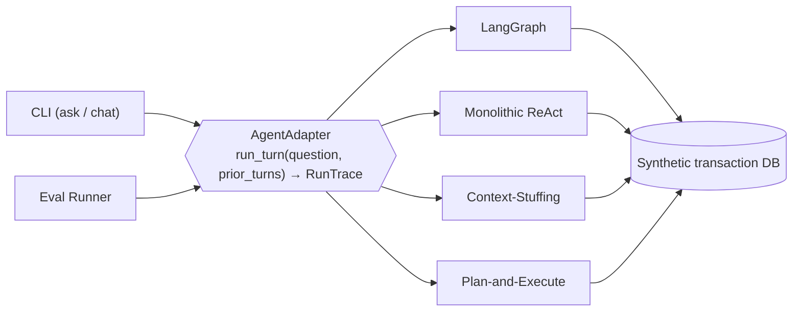
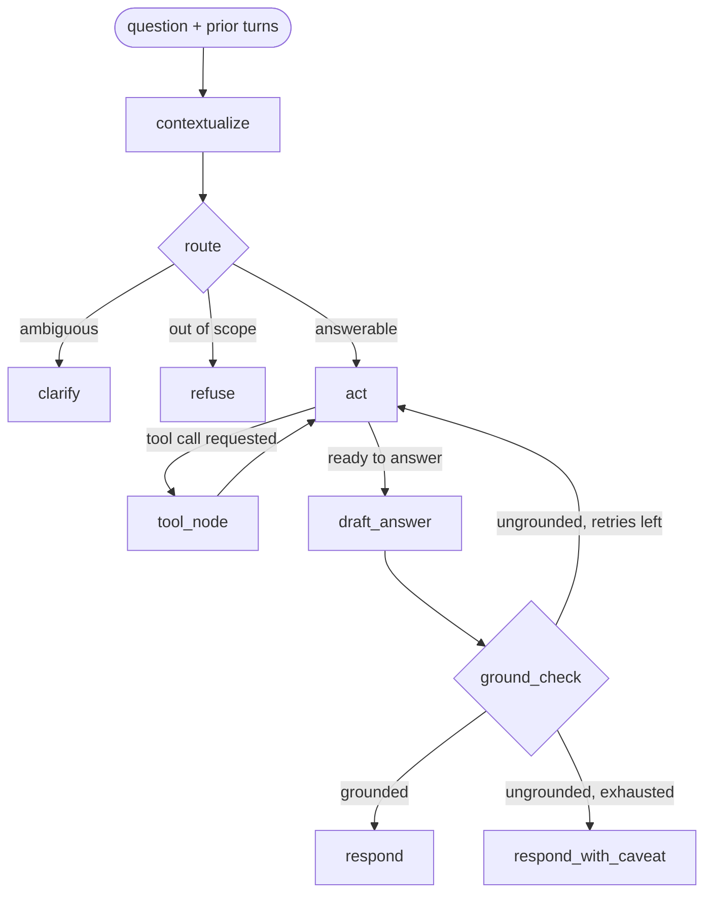
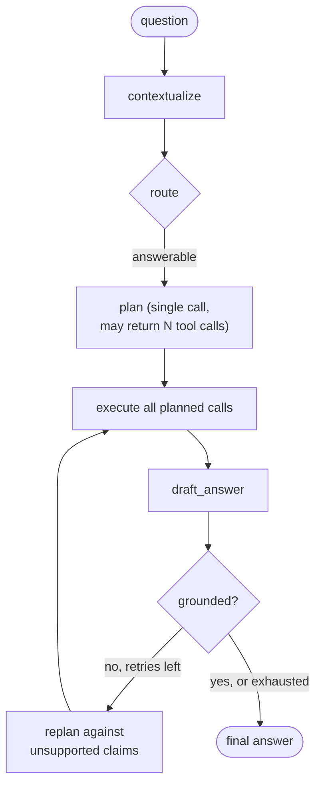

# Comparing Agentic Architectures for Grounded Financial Question Answering

## Abstract

A natural-language question about a user's own financial transactions has an unusual property for an LLM application: it has exactly one correct, mechanically computable answer. This makes personal-finance Q&A a clean testbed for comparing agentic architectures on objective grounds rather than subjective preference. We implement and evaluate four architectures that answer the identical set of questions over the identical transaction database, behind a single shared interface: a LangGraph state machine with explicit context-resolution, routing, tool-use, and groundedness-verification stages; a monolithic single-prompt ReAct loop; a context-stuffing design with no tool calls at all; and a plan-and-execute design that separates planning from execution and interleaves neither. All four are scored with the same rule-based harness — no LLM-as-judge — across numeric correctness, groundedness (both self-reported and independently recomputed), contextual correctness, clarification/refusal behavior, and tool-call efficiency. No architecture dominates on every axis: the state-machine and plan-and-execute designs are the only two to score 100% on both groundedness checks, context-stuffing is the only one to fall to 50% on groundedness despite otherwise-reasonable behavior, and the two ReAct-style architectures (state-machine and monolithic) are the most tool-call-inefficient while the two non-interleaving designs (context-stuffing, plan-and-execute) are the most efficient. We report the concrete failure traces behind each of these results and discuss what they say about the trade-offs between interleaved reasoning, upfront planning, and forgoing tool use altogether.

## 1. Introduction and Problem Statement

### 1.1 The Task

The system answers natural-language questions about a user's own transaction history: simple aggregations ("how much did I spend on groceries in July?"), multi-condition filters, period-over-period comparisons, trend and anomaly detection, and follow-up questions within a conversation that depend on what was asked before. Two behaviors are required alongside correctness: the system must decline genuinely out-of-scope questions (e.g., "what's my credit score?") rather than fabricate an answer, and it must ask for clarification rather than guess when a question is genuinely ambiguous (e.g., "how much did I spend this month?" with no month specified).

### 1.2 Why This Task Is a Good Architecture Comparison

Unlike open-ended chat or retrieval-augmented generation over unstructured text, every question in this domain has a single, deterministic ground truth computable directly from the underlying data. That property is what makes it possible to score agent output with rule-based checks instead of a second LLM's judgment, and to hold everything except the architecture itself constant across a comparison: the same database, the same fifteen questions, the same underlying model, the same tool implementations. Any difference in outcome is attributable to how the architecture decides what to call and how it decides what it has enough information to say.

### 1.3 What This Report Is (and Isn't)

This report does not conclude that any one of the four architectures is "best." Each embodies a different point on a small number of independent design axes — interleaved reasoning vs. upfront planning, tool calls vs. a precomputed context window, single-stage vs. multi-stage decision-making — and the results below show each paying for its design in a different currency (tool-call volume, groundedness, or answer correctness) with no clean winner across all of them. The goal is to make those trade-offs visible and quantified, not to declare a champion.

### 1.4 Scope and Non-Goals

The dataset is entirely synthetic — no real personal financial data is used. Conversational memory is scoped to a single session; there is no cross-session persistence. The interface is a command-line tool; there is no web UI or production deployment. All four architectures share the same six underlying tool implementations and the same SQLite transaction database; none is evaluated against a different toolset or data source.

## 2. Evaluation Methodology

### 2.1 Dataset Construction

The transaction dataset is synthetic and deterministically generated (seed 42): 18 months of transactions (July 2024 – December 2025) across 11 categories, 22 merchants, and 2 accounts. Two anomalies are deliberately injected so the trend/anomaly-detection tools have a known, labeled target: a recurring subscription (StreamFlix) whose price increases from $13.99 to $17.99 in June 2025, and a spending spike in the Shopping category in November 2025 ($1,402.09, roughly double a typical month).

Test-case labels are computed by running the actual tool functions against this data, not by hand-computing expected values, and were independently re-verified for this report by calling those same tool functions directly (bypassing every architecture and the LLM entirely) — all fifteen labels check out against the live database.

### 2.2 Test Set

Fifteen cases were curated to cover a deliberate spread of difficulty and failure modes rather than volume:

| Category | Cases | Tests |
|---|---|---|
| Simple lookup | 2 | Single-category, single-month aggregation |
| Multi-condition | 2 | Amount thresholds, merchant filters |
| Comparison | 2 | Category-vs-category, period-vs-period |
| Trend/anomaly | 2 | The two injected anomalies |
| Ambiguous | 1 | Should trigger clarification, not a guess |
| Out-of-scope | 2 | Should be refused (one deliberately finance-adjacent: "what's my credit score?") |
| Multi-turn | 3 sequences | Implicit reference, scope carry-over, comparative follow-up, and clarification mid-conversation |
| Adversarial | 1 | A derived-percentage question probing whether a computed (not directly-queried) value is still correctly grounded |

### 2.3 Metrics

Six metrics are scored per turn, each a deterministic function of the turn's execution trace (question, resolved question, tool-call ledger, draft answer with claims, routing decision, final answer) — no metric depends on a second LLM's judgment:

- **Numeric correctness** — does any claimed value match the expected value within tolerance?
- **Groundedness**, computed two independent ways:
  - *Self-reported*: does the agent's own in-architecture groundedness check agree with the expected verdict?
  - *Harness-computed*: applying that same verification function independently, outside the agent, to the raw ledger and claims — so groundedness is measured the same way regardless of whether an architecture implements its own internal check at all.
- **Contextual correctness** — in a multi-turn sequence, did the resolved category/date range/comparison baseline actually match what the follow-up implied?
- **Clarification** — did the agent ask when (and only when) it should have, checked in both directions?
- **Refusal** — symmetric check for declining out-of-scope questions.
- **Efficiency** — actual tool calls used versus a hand-verified *optimal* tool-call count for that question given the shared toolset. A case "passes" if actual ≤ optimal; the *overage* (actual − optimal) is also recorded so a gap is visible as a magnitude, not just a pass/fail bit.

Denominators vary by metric: clarification/refusal apply to every case, numeric correctness/efficiency only to `answer`-routed cases, and contextual correctness only to multi-turn follow-ups with a declared expectation.

### 2.4 The Shared Interface

All four architectures implement one interface, `AgentAdapter.run_turn(question, prior_turns) → RunTrace`, driven identically by both the CLI and the evaluation harness. This is what makes the comparison in Section 4 a controlled one: the harness never touches an architecture's internals, only this one seam, so no architecture is scored on more favorable terms than another.

### 2.5 Experimental Setup

- **Model:** `gemini-3.5-flash-lite` for every LLM call in every architecture.
- **Dataset and toolset:** identical across all four runs.
- **Runs:** `langgraph-gemini-3.5-flash-lite`, `monolithic-gemini-3.5-flash-lite`, `context_stuffing-gemini-3.5-flash-lite`, `plan_execute-gemini-3.5-flash-lite`. All four completed all 15 cases with no interrupted or errored cases.

## 3. The Four Architectures

### 3.1 LangGraph (State Machine)

A four-stage LangGraph state machine: an explicit `contextualize` stage resolves references against prior turns, `route` classifies the resolved question as answerable/ambiguous/out-of-scope, an `act`/`tool_node` loop interleaves tool calls with reasoning (observe a result, decide the next call), and a deterministic `ground_check` verifies every claim in the draft answer against the ledger, retrying the draft (not the tool calls) on failure before falling back to an explicit caveat.

This is the most structurally elaborate of the four: every decision (whether to resolve a reference, whether to route to clarify/refuse/answer, whether a draft is grounded) is its own explicit stage with its own prompt, and the tool loop can observe each result before deciding the next call.

### 3.2 Monolithic ReAct

A single system prompt and a single ReAct-style tool-calling loop, with no separate contextualization or routing stage: prior turns are folded into the message history as plain text, the model calls tools until it stops or hits a step limit, and one final structured-output call simultaneously decides the route (answer/clarify/refuse) *and* drafts the answer in the same call. Groundedness is checked once, with no retry — an ungrounded draft goes out with a caveat immediately.

This collapses four of the state machine's five decision points into one prompt and one call, at the cost of losing dedicated, independently-tunable prompts for each decision.

### 3.3 Context-Stuffing

No tool calls at all. A summary of the entire dataset — monthly totals per category, plus every detected subscription price change — is precomputed once when the adapter is constructed and injected directly into the draft-answer prompt on every turn. `contextualize` and `route` are reused unchanged from the LangGraph baseline; only the tool-calling stage is replaced by a static context block. The one ledger entry the architecture ever produces is synthetic — the whole context table wrapped as a single `context_table` "tool result" — purely so the same groundedness verifier used by every other architecture can check it without special-casing.

This trades away the ability to answer any question the precomputed summary doesn't cover (e.g., a per-transaction amount threshold) for the lowest possible latency and tool-call count on questions it *can* answer.

### 3.4 Plan-and-Execute

`contextualize` and `route` are again reused unchanged from the baseline. The tool-use stage is replaced with an upfront batch plan: a single native function-calling invocation returns every tool call the model believes it needs, all of which are executed before the model is asked anything else — no interleaving, no observing one result before deciding the next call. Planning is deliberately implemented as "make one non-interleaved multi-tool-call request" through the same native function-calling every other architecture uses for execution, rather than a bespoke planning language — a structured-output schema for an open-ended plan is a harder target for constrained decoding to fill in reliably than the tool-call format the model was actually trained on. If the resulting draft is ungrounded, a bounded re-plan (not a full retry from scratch) is attempted, given the existing ledger and a description of which claims failed verification.

## 4. Comparison Results

### 4.1 Overall Pass Rates

| Metric | LangGraph | Monolithic | Context-Stuffing | Plan-and-Execute |
|---|---|---|---|---|
| Numeric correctness | **100%** | 83.3% | 83.3% | 75.0% |
| Groundedness (self-reported) | **100%** | **100%** | 50.0% | **100%** |
| Groundedness (harness-computed) | **100%** | **100%** | 50.0% | **100%** |
| Contextual correctness | **100%** | 50.0% | 0.0% | **100%** |
| Clarification | 86.7% | 80.0% | 93.3% | **93.3%** |
| Refusal | **100%** | **100%** | **100%** | **100%** |
| Efficiency (actual ≤ optimal) | 16.7% | 50.0% | **100%** | 66.7% |

Bold marks the best result on each row; ties are both bolded. No architecture wins more than three of the seven rows, and none loses every row either — the state machine and plan-and-execute tie for the most wins (three apiece), but on entirely different metrics.

### 4.2 Per-Case Detail

| Case | LangGraph | Monolithic | Context-Stuffing | Plan-and-Execute |
|---|---|---|---|---|
| simple_001 (groceries, Jul 2024) | correct (2 calls) | correct (1 call) | correct (1 call) | correct (1 call) |
| simple_002 (dining, Dec 2025) | correct (2 calls) | correct (2 calls) | correct (1 call) | correct (1 call) |
| oos_001 (investment advice) | refused | refused | refused | refused |
| multi_cond_001 (Shopping >$100, 2025) | correct (2 calls) | correct (1 call) | wrong value, ungrounded | correct (2 calls, 1 retry) |
| multi_cond_002 (Fresh Market, 2025) | correct (1 call) | correct (1 call) | wrong value | correct (1 call) |
| comparison_001 (dining vs. groceries, Q1 2025) | correct (3 calls) | correct (3 calls) | correct, but ungrounded | correct (2 calls) |
| comparison_002 (Shopping Oct vs. Nov 2025) | correct (2 calls) | correct (1 call) | correct (1 call) | correct (1 call) |
| trend_001 (subscription price change) | correct (1 call) | correct (1 call) | correct (1 call) | wrong — resolved the wrong date range |
| trend_002 (Shopping spike) | correct (2 calls) | wrong — resolved the wrong date range | correct (1 call) | correct, but 2 calls |
| ambiguous_001 (should clarify) | wrong — answered instead | wrong — answered instead | wrong — answered instead | wrong — answered instead |
| oos_002 (credit score) | refused | refused | refused | refused |
| adversarial_001 (% groceries vs. dining) | correct (3 calls) | correct (3 calls) | correct, but ungrounded | wrong — gave up, no data cited |
| multi_001 (dining → groceries → comparison) | correct, contextually correct (7 calls) | wrong value, not contextually correct | correct value, ungrounded, not contextually correct | wrong value, contextually correct |
| multi_002 (Transport Q1 → Q2) | correct, contextually correct (4 calls) | correct, contextually correct (3 calls) | correct value, ungrounded, not contextually correct | correct, contextually correct (2 calls) |
| multi_003 (Utilities 2025 → "last time"?) | correct, but didn't clarify on turn 2 | correct, but didn't clarify on turn 2 | correct, but didn't clarify on turn 2 | correct, correctly clarified on turn 2 |

All four architectures failed `ambiguous_001` identically — every one answered "how much did I spend this month?" instead of asking which month, despite none of the four ever being told the dataset's actual date range or a reference "today" (Section 5.3). Plan-and-Execute is the only architecture to get the *equivalent* clarification case right in `multi_003`.

## 5. Discussion

### 5.1 No Architecture Is Strictly Better

The headline result is the absence of a headline result: LangGraph is the only architecture with perfect numeric correctness, but it is also the least tool-call-efficient by a wide margin (16.7% vs. 50–100% for the others). Context-Stuffing is the most efficient by construction — it never calls a tool, so it trivially "passes" efficiency on 6/6 scorable cases — but it is also the only architecture whose groundedness collapses to 50%, for a reason specific to its design (Section 5.2). Plan-and-Execute matches the state machine on groundedness and contextual correctness while using far fewer tool calls, but has the lowest numeric correctness of the four, driven by two failures the other three architectures didn't make in the same way (Section 5.4). Choosing among these is choosing which failure mode you can tolerate, not picking a winner.

### 5.2 Why Context-Stuffing's Groundedness Collapses

Context-Stuffing's 50% groundedness rate is not a random accuracy problem — every ungrounded case traces to the same structural cause. Its single synthetic ledger entry is the entire precomputed context table (monthly totals per category, an 18-month-by-11-category grid), so the groundedness verifier's job — "does this claimed number appear somewhere in the cited ledger entry?" — becomes nearly impossible to fail even when the number is wrong, and nearly impossible to *pass meaningfully* when the number is right, because almost any plausible dollar figure appears *somewhere* in a table that large. Concretely, on `multi_cond_001` ("Shopping transactions over $100 in 2025") the model correctly recognized it could not compute a per-transaction threshold from monthly aggregates and said so explicitly, but the aggregate figure it fell back to reporting could not be tied to a specific cited value in a way the verifier accepted — the honest answer and the verifier's mechanics disagreed. This is not a prompt-tuning problem; it is what happens structurally when "the ledger" is a static blob rather than a sequence of scoped, individually-checkable tool calls. A groundedness check is only as sharp as the granularity of what it's checking against.

### 5.3 The Shared "This Year" / "Recently" Failure

`ambiguous_001` failed identically across all four architectures, and `trend_001`/`trend_002` show a related pattern: Monolithic resolved "recently" to a spending peak in **August/November 2024** rather than the actual November 2025 spike, and Plan-and-Execute resolved "this year" for the subscription-change question to **all of 2024** rather than 2025, in both cases citing a real (grounded) but wrong-period number. None of the four architectures' prompts inject the dataset's actual date range or a "current date" reference anywhere — every one leaves "this year," "recently," and "this month" to the model's own, unanchored notion of the present. LangGraph and Context-Stuffing happened to resolve these correctly on this run; Monolithic and Plan-and-Execute did not. This is best read as a shared gap in the evaluation setup itself, not a differentiator between architectures — the fix (inject the data's actual date range into the contextualization prompt) is orthogonal to which architecture receives it, and would plausibly change several of these specific outcomes without touching the architectural comparison at all.

### 5.4 Plan-and-Execute's Failure Mode: Committing to an Incomplete Plan

Plan-and-Execute's two clearest failures — `trend_001` and `adversarial_001` — share a mechanism distinct from Context-Stuffing's. On `adversarial_001` ("by what percentage did I spend more on groceries than dining in Q1 2025?"), the single upfront plan call requested only `list_categories_tool`, and the architecture executed exactly that plan and drafted an answer admitting "there are no transaction or spending amounts provided... to calculate a percentage difference" — a correctly *grounded* non-answer, but not the answer requested, and the retry-on-ungroundedness loop never triggers here because the draft never asserted an ungrounded claim in the first place; it just gave up. This is the direct cost of *not* interleaving: an interleaved loop (LangGraph, Monolithic) can react to `list_categories_tool`'s result and immediately decide it isn't enough; a single non-interleaved plan call that underspecifies what it needs has no chance to correct itself until a full draft-and-check cycle completes, and the retry mechanism here is designed to catch *ungrounded* claims, not *incomplete* plans. The re-plan-on-failure design is exactly the right compensating mechanism for this trade-off, but it depends on the draft stage producing an ungrounded (not merely evasive) answer to trigger — a gap between "wrong" and "unsupported" that this run exposes concretely.

### 5.5 Tool-Call Efficiency Tracks Interleaving, Not Correctness

The efficiency ordering (Context-Stuffing 100% > Plan-and-Execute 66.7% > Monolithic 50% > LangGraph 16.7%) tracks almost exactly how much interleaved back-and-forth each architecture's design permits, and is close to inversely related to how much of the reasoning is done in a single shot. LangGraph's `act` loop can call a tool, look at the result, and decide to call another — and it does, repeatedly: `list_categories_tool` before an aggregation whose category was already named in the question, and iterative date-range probing on `comparison_001`/`adversarial_001`/`multi_001` (up to 7 calls where 3 were optimal). Plan-and-Execute structurally cannot do this kind of iterative probing — it plans once, executes, and only gets a second attempt through the bounded re-plan-on-ungroundedness path — which is exactly why it uses fewer calls, at the cost of the incomplete-plan failure mode in Section 5.4. Efficiency and correctness are not the same axis: the two least efficient architectures include both the most correct (LangGraph) and a middling one (Monolithic), so "fewer tool calls" should be read as a cost signal, not a quality signal, in this comparison.

### 5.6 Limitations

- **Single run, single model.** Each architecture was evaluated once, against one model (`gemini-3.5-flash-lite`); several of the per-case outcomes above (e.g., which architectures resolved "this year" correctly) plausibly have real run-to-run variance that a single run cannot separate from a structural property of the architecture.
- **Sample size.** Fifteen cases are enough to characterize specific, concrete failure traces — which is what this report relies on — but not enough to treat the percentage gaps in Section 4.1 as precise measurements; a single additional pass or failure shifts several rates by 6–7 percentage points.
- **Context-Stuffing's context table caps what it can be asked.** Its 83.3% numeric correctness and 0% contextual correctness are partly a direct, structural consequence of a monthly-category-total summary having no per-transaction or per-merchant granularity, not purely a reasoning quality gap relative to the other three — this is a known, deliberate limitation of the design, not a surprise.

### 5.7 Future Work

- **Anchor "this year" / "recently" to the dataset's actual date range.** Per Section 5.3, this is the one failure shared by all four architectures and the most concrete, low-effort next step: inject the data's actual min/max transaction date (or a configured "current date") into the `contextualize` prompt used by every architecture, then re-run this same fifteen-case comparison to see whether `ambiguous_001`, `trend_001`, and `trend_002` resolve consistently once the confound is removed.
- **Give Context-Stuffing a scoped ledger.** Section 5.2 traced its groundedness collapse to citing one large static table as a single ledger entry rather than something scoped per claim. A cheap fix worth testing: split the precomputed context table into one synthetic ledger entry per category (or per category-month), so a claim can be checked against the specific slice it's actually drawn from instead of the whole table at once — without giving the architecture any real tool calls.
- **Teach Plan-and-Execute to recognize an incomplete plan, not just an ungrounded draft.** Section 5.4 showed the retry-on-ungroundedness path never triggers when the model's draft is a grounded non-answer ("no data provided") rather than an unsupported claim. A validation step after planning — e.g., checking the plan against the question's named categories/date ranges before executing it — could catch this class of failure before it reaches the draft stage at all.
- **Address LangGraph's and Monolithic's tool-call habits.** The two least efficient architectures share two identifiable, prompt-level patterns: calling `list_categories_tool` before an aggregation whose category was already named in the question, and iterative single-value date-range probing instead of one `group_by`- or `compare_periods_tool`-based call. A targeted system-prompt revision addressing both, re-run against this same test set, would produce a genuine before/after efficiency comparison for each architecture independently.
- **Repeat across multiple runs and models.** Per the limitations in Section 5.6, this comparison is a single run per architecture on one model; repeating it (either multiple seeds of the same model, or a second model entirely) would show which of the per-case outcomes above are stable architectural properties versus one-off model variance — particularly the "this year" resolution, which split 2-2 across the four architectures on this run.
- **Grow the trend/anomaly and multi-turn categories.** These are both the most temporally-dependent cases and, across this comparison, the ones showing the most inter-architecture disagreement (Section 4.2) — a larger, harder set in these two categories specifically would sharpen the comparison where it currently has the least data to work with (two and three cases respectively).

## 6. Conclusion

Four architectures answering the identical fifteen questions over the identical data produced four different failure profiles, not a ranking: LangGraph's interleaved state machine achieved perfect correctness at the cost of the most tool calls; Plan-and-Execute matched its groundedness and contextual-correctness scores using far fewer calls but is vulnerable to committing to an incomplete upfront plan; Monolithic collapsed four decision stages into one prompt with a moderate cost across most metrics rather than a sharp failure on any one; and Context-Stuffing's zero-tool-call design is maximally efficient but exposed a structural weakness in what "groundedness" can mean when the cited evidence is one large static table rather than discrete, scoped tool results. The one failure shared by all four — resolving temporally relative phrases like "this year" and "recently" with no anchor to the dataset's actual date range — is a gap in the shared evaluation setup, not a distinguishing result, and is the most concrete, architecture-independent next fix suggested by this comparison. The evaluation harness's architecture-agnostic interface is what made this an apples-to-apples comparison at all; the next useful step is re-running it after that one shared fix, to see which of these four trade-off profiles persists once the shared confound is removed.
